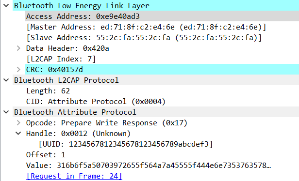

# BTLE

> I stored my flag inside a remote database, but when I tried to read it back it had been redacted! Can you recover what I wrote?

Attached is a PCAP file.

## Description

By looking at the pcap file in Wireshark we see that it is Bluetooth communication.

A lot of packets don't have relevant data in them.
Relevant data are in packets who have the `Bluetooth Attribute Protocol`.
We can filter them with the filter `btatt`.

We see a packet with a flag, but sadly it is redacted as specified in the challenge description.

However we see a lot of packets which write data on the server, such as this one:



Data is written at some specific offset. So we can retrieve the flag!

## Solution

I'm using Scapy to read the PCAP and extract the data.

```python
from scapy.all import *

current = []
for packet in rdpcap('btle.pcap'):
    if "Prepare Write Response" in packet:       
        offset = packet["Prepare Write Response"].offset
        data = bytes(packet["Prepare Write Response"].data)
        if offset + len(data) > len(current):
            current = current + ([0] * (offset + len(data) - len(current)))
        for i in range(offset, offset + len(data)):
            current[i] = data[i - offset]
print(current)
print("".join([chr(x) for x in current]))
```

Flag: `pctf{b1Ue_te3Th_is_ba4d_4_y0u_jUs7_4sk_HAr0lD_b1U3tO07h}`
