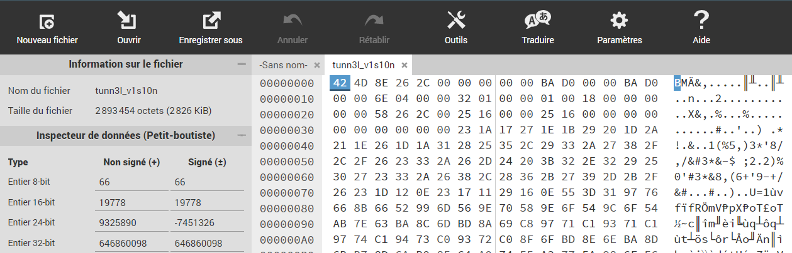
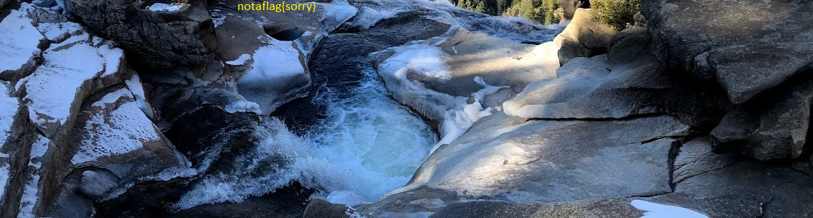
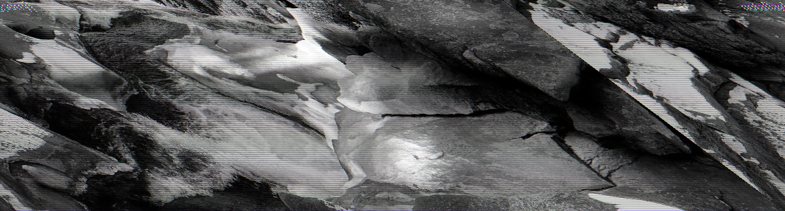
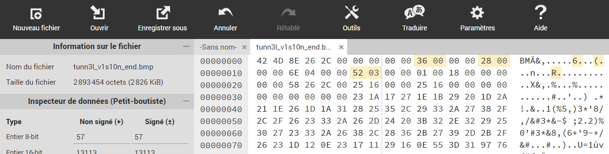
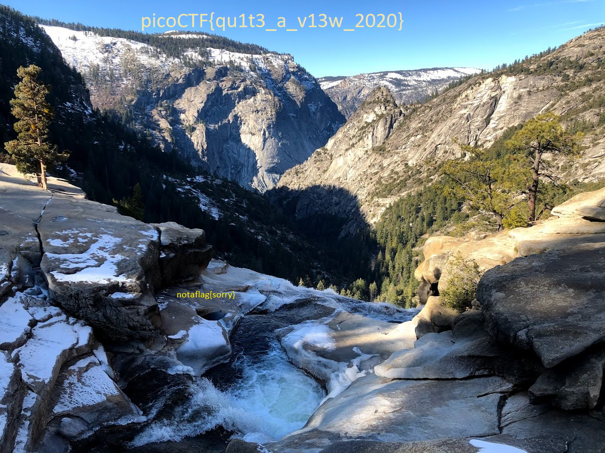

# tunn3l v1s10n

We found this file. Recover the flag.

## Description

We get a file called `tunn3l_v1s10n`. My first reflex is to try to find the flag: `strings tunn3l_v1s10n | grep pico` but no luck.

So I try to discover what type of file I have: `file tunn3l_v1s10n` gives me only `data` as an answer.

Next I try to see if something is hidden in it with `binwalk` but no luck.
Also display the bytes of the file with `hexdump -C tunn3l_v1s10n | less` but I don't see anything relevant.

So I guess the file is probably a correct file but with a malformed header or something. I try to find what kind of file it is by checking if the first bytes correspond to a known magic number.
I just go to [this list](https://en.wikipedia.org/wiki/List_of_file_signatures) and Ctrl-F the first bytes output by `hexdump`.
Bingo! This is BMP image.

## Solution

So I have a BMP image with a broken header.

I look on Google and find a specification for BMP:


Now want to look at the bytes of my file and to modify them, so I load my file to [HexEd.it](https://hexed.it/).



So here in my file I have the magic bytes `42 4D` then a size of 0x2c268e bytes, and the offset for the pixel array is 0xd0ba.

Then goes the DIB header, and here it seems off, as it also indicates a size of 0xd0ba for the header, while it should only be 40 bytes! So let's change it, and replace `BA D0` by `28 00`, and save the image with a BMP extension.

And yeah! It looks like an image I can open!
I get a strange image though, so probably I also need to modify the offset of where the pixel array can be found, so I change it to 54 bytes like in the specification.



Sadly this is not yet our flag... And here I remark that the image I got before changing the offset was slightly different (there was more image above the `notaflag` part). This means my image must be bigger.

Right now my image is 1134 * 306 pixels, and each pixel takes 3 bytes (one for each color).

I tried to increase the width of the image by 10 pixels, but it messed up my image:



However the same did not apply when I increased the height of the image.
I just needed to find the height of my image. Recall that there are 0x2c268e bytes in total, a 54 bytes header and 1134 pixels width, with 3 bytes per pixel. Thus my height is:

```python
(0x2c268e - 54) // (3*1134) = 850
```

So I input 850 = 0x352 in the header.



And here is the flag:



Flag: `picoCTF{qu1t3_a_v13w_2020}`