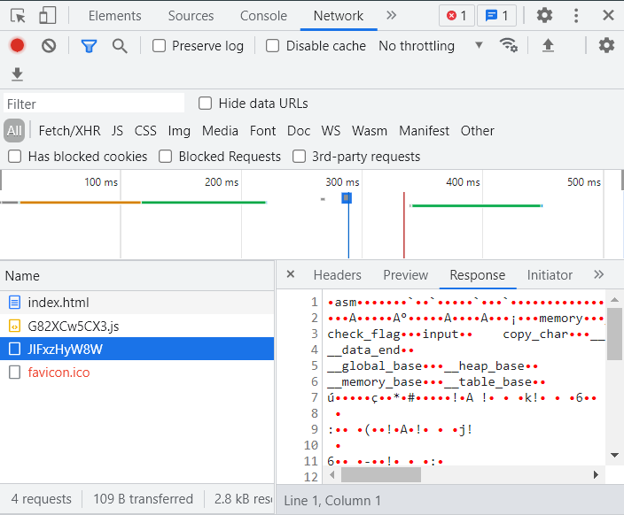

# Some Assembly Required 1

> http://mercury.picoctf.net:36152/index.html

## Description

I go to the website and there is a field to enter the flag, and a button answers if it is correct or incorrect.

By looking at the source, I see the Javascript is provided.

```javascript
const _0x402c=['value','2wfTpTR','instantiate','275341bEPcme','innerHTML','1195047NznhZg','1qfevql','input','1699808QuoWhA','Correct!','check_flag','Incorrect!','./JIFxzHyW8W','23SMpAuA','802698XOMSrr','charCodeAt','474547vVoGDO','getElementById','instance','copy_char','43591XxcWUl','504454llVtzW','arrayBuffer','2NIQmVj','result'];const _0x4e0e=function(_0x553839,_0x53c021){_0x553839=_0x553839-0x1d6;let _0x402c6f=_0x402c[_0x553839];return _0x402c6f;};(function(_0x76dd13,_0x3dfcae){const _0x371ac6=_0x4e0e;while(!![]){try{const _0x478583=-parseInt(_0x371ac6(0x1eb))+parseInt(_0x371ac6(0x1ed))+-parseInt(_0x371ac6(0x1db))*-parseInt(_0x371ac6(0x1d9))+-parseInt(_0x371ac6(0x1e2))*-parseInt(_0x371ac6(0x1e3))+-parseInt(_0x371ac6(0x1de))*parseInt(_0x371ac6(0x1e0))+parseInt(_0x371ac6(0x1d8))*parseInt(_0x371ac6(0x1ea))+-parseInt(_0x371ac6(0x1e5));if(_0x478583===_0x3dfcae)break;else _0x76dd13['push'](_0x76dd13['shift']());}catch(_0x41d31a){_0x76dd13['push'](_0x76dd13['shift']());}}}(_0x402c,0x994c3));let exports;(async()=>{const _0x48c3be=_0x4e0e;let _0x5f0229=await fetch(_0x48c3be(0x1e9)),_0x1d99e9=await WebAssembly[_0x48c3be(0x1df)](await _0x5f0229[_0x48c3be(0x1da)]()),_0x1f8628=_0x1d99e9[_0x48c3be(0x1d6)];exports=_0x1f8628['exports'];})();function onButtonPress(){const _0xa80748=_0x4e0e;let _0x3761f8=document['getElementById'](_0xa80748(0x1e4))[_0xa80748(0x1dd)];for(let _0x16c626=0x0;_0x16c626<_0x3761f8['length'];_0x16c626++){exports[_0xa80748(0x1d7)](_0x3761f8[_0xa80748(0x1ec)](_0x16c626),_0x16c626);}exports['copy_char'](0x0,_0x3761f8['length']),exports[_0xa80748(0x1e7)]()==0x1?document[_0xa80748(0x1ee)](_0xa80748(0x1dc))[_0xa80748(0x1e1)]=_0xa80748(0x1e6):document[_0xa80748(0x1ee)](_0xa80748(0x1dc))[_0xa80748(0x1e1)]=_0xa80748(0x1e8);}
```

Well the JS is obfuscated, so I go to [this JS deobfuscator](https://lelinhtinh.github.io/de4js/) and I get a more readable code:

```javascript
const _0x402c = ['value', '2wfTpTR', 'instantiate', '275341bEPcme', 'innerHTML', '1195047NznhZg', '1qfevql', 'input', '1699808QuoWhA', 'Correct!', 'check_flag', 'Incorrect!', './JIFxzHyW8W', '23SMpAuA', '802698XOMSrr', 'charCodeAt', '474547vVoGDO', 'getElementById', 'instance', 'copy_char', '43591XxcWUl', '504454llVtzW', 'arrayBuffer', '2NIQmVj', 'result'];
const _0x4e0e = function (_0x553839, _0x53c021) {
    _0x553839 = _0x553839 - 0x1d6;
    let _0x402c6f = _0x402c[_0x553839];
    return _0x402c6f;
};
(function (_0x76dd13, _0x3dfcae) {
    const _0x371ac6 = _0x4e0e;
    while (!![]) {
        try {
            const _0x478583 = -parseInt(_0x371ac6(0x1eb)) + parseInt(_0x371ac6(0x1ed)) + -parseInt(_0x371ac6(0x1db)) * -parseInt(_0x371ac6(0x1d9)) + -parseInt(_0x371ac6(0x1e2)) * -parseInt(_0x371ac6(0x1e3)) + -parseInt(_0x371ac6(0x1de)) * parseInt(_0x371ac6(0x1e0)) + parseInt(_0x371ac6(0x1d8)) * parseInt(_0x371ac6(0x1ea)) + -parseInt(_0x371ac6(0x1e5));
            if (_0x478583 === _0x3dfcae) break;
            else _0x76dd13['push'](_0x76dd13['shift']());
        } catch (_0x41d31a) {
            _0x76dd13['push'](_0x76dd13['shift']());
        }
    }
}(_0x402c, 0x994c3));
let exports;
(async () => {
    const _0x48c3be = _0x4e0e;
    let _0x5f0229 = await fetch(_0x48c3be(0x1e9)),
        _0x1d99e9 = await WebAssembly[_0x48c3be(0x1df)](await _0x5f0229[_0x48c3be(0x1da)]()),
        _0x1f8628 = _0x1d99e9[_0x48c3be(0x1d6)];
    exports = _0x1f8628['exports'];
})();

function onButtonPress() {
    const _0xa80748 = _0x4e0e;
    let _0x3761f8 = document['getElementById'](_0xa80748(0x1e4))[_0xa80748(0x1dd)];
    for (let _0x16c626 = 0x0; _0x16c626 < _0x3761f8['length']; _0x16c626++) {
        exports[_0xa80748(0x1d7)](_0x3761f8[_0xa80748(0x1ec)](_0x16c626), _0x16c626);
    }
    exports['copy_char'](0x0, _0x3761f8['length']), exports[_0xa80748(0x1e7)]() == 0x1 ? document[_0xa80748(0x1ee)](_0xa80748(0x1dc))[_0xa80748(0x1e1)] = _0xa80748(0x1e6) : document[_0xa80748(0x1ee)](_0xa80748(0x1dc))[_0xa80748(0x1e1)] = _0xa80748(0x1e8);
}
```

There is a function `onButtonPress`, which is called when I try to guess the flag.
Helped with the console in the inspector, I understand that globally my input is copied in the `exports` module thanks to the function `copy_char`, and then `check_flag` is called (this is the check `exports[_0xa80748(0x1e7)]() == 0x1` performed on the last line).

`exports` is defined with those lines:
```javascript
let exports;
(async () => {
    const _0x48c3be = _0x4e0e;
    let _0x5f0229 = await fetch(_0x48c3be(0x1e9)),
        _0x1d99e9 = await WebAssembly[_0x48c3be(0x1df)](await _0x5f0229[_0x48c3be(0x1da)]()),
        _0x1f8628 = _0x1d99e9[_0x48c3be(0x1d6)];
    exports = _0x1f8628['exports'];
})();
```

So by going to the Network tab I should be able to see the WebAssembly.



The goal is to disassemble it to understand the `check_flag` function.

## Solution

By looking on the net, I have found the [wasm2c](https://github.com/WebAssembly/wabt/tree/main/wasm2c) project.

It takes as input a WASM file and tries to disassemble it to a C file.
I install it with `apt install wasm2c` and then disassemble my WASM file with `wasm2c JIFxzHyW8W -o JIFxzHyW8W.c`.

The C file is quite long so I will not paste it here, but I do see the `check_flag` function.
I also see the data section:
```c
static const u8 data_segment_data_0[] = {
  0x70, 0x69, 0x63, 0x6f, 0x43, 0x54, 0x46, 0x7b, 0x64, 0x38, 0x38, 0x30, 
  0x39, 0x30, 0x65, 0x36, 0x37, 0x39, 0x63, 0x34, 0x38, 0x66, 0x33, 0x39, 
  0x34, 0x35, 0x66, 0x63, 0x61, 0x61, 0x36, 0x61, 0x37, 0x64, 0x36, 0x64, 
  0x37, 0x30, 0x63, 0x35, 0x7d, 0x00, 0x00, 
};
```

I convert it with Python and the flag appears.

Flag: `picoCTF{d88090e679c48f3945fcaa6a7d6d70c5}`