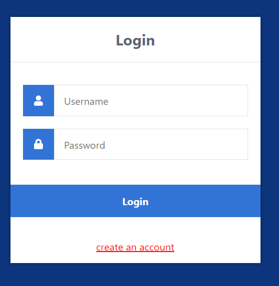
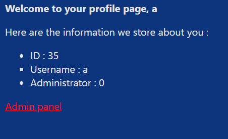
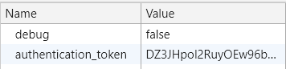

# Backflip in the kitchen

> Eat my cookie sharkyboy!
> 
> Look how great my authentication is.
> 
> I used AES 128 CBC for encryption never used it before but it's so cooool!!
> 
> backflip_in_the_kitchen.sharkyctf.xyz

## Description

Let's connect to the website.



We can see a login page, so we create an account and connect.



Here we can see some information about the account I just created: the username is mirrored by the webpage, we are given an ID and we are not administrator.

When trying to connect to the admin panel, we get back a message:

`Hello a. I'm sorry but you are not allowed to see what's in there. peace.`.

## Solution

This is a crypto challenge, but let's first do some recon on the website. In the inspector, we look at the source, the console, the network tab and the cookies. We see some interesting cookies:



So we have an authentication token which is base64 encoded, and a debug cookie. Let's change the debug cookie to true. The only difference is a new script that appears in the source:

```html
<script>console.log({"id":35,"is_admin":0,"username":"a"});</script>
```

From the challenge description, I suppose the authentication token is encrypted with [AES-CBC](https://en.wikipedia.org/wiki/Block_cipher_mode_of_operation#Cipher_block_chaining_(CBC)) on 128 bits. My first reflex is to perform a [padding-oracle attack](https://en.wikipedia.org/wiki/Padding_oracle_attack#Padding_oracle_attack_on_CBC_encryption) to decrypt the token. Indeed, when flipping a bit in the token, I get back a message:

```
BAD TOKEN, CAN'T PARSE YOU! YOU MEAN TOKEN! BAD TOKEN!
```

However the padding oracle attack fails, because this same error seems to happen even if the padding is correct, but the message cannot be interpreted correctly. I guess I could have tried a timing attack, but this is really tricky to implement and not reliable.

Then I recall that the debug flag made something appear. So I try to flip bits in the IV (the first 16 bytes of the ciphertext). In CBC mode, this will randomize the IV (but it does not matter as the IV is discarded) and will flip the same corresponding bit in the plaintext. And bingo! I see that the json `{"id":35,"is_admin":0,"username":"a"}` has a bit flipped when I flip a bit in the IV.

Therefore the objective is to flip the 0 to 1 in the `is_admin` variable. Sadly, the first block is only 16 bytes long, and the bit we want to change is on byte 20. But then, as we have the plaintext, we may change it completely. The goal here is put the `is_admin` variable at the beginning of the json.

The following script does exactly this:

```python
import requests
import base64

headers = {'Connection': 'keep-alive',
           'Accept': 'text/html,application/xhtml+xml,application/xml;q=0.9,image/webp,image/apng,*/*;q=0.8,application/signed-exchange;v=b3;q=0.9',
           'Referer': 'http://backflip_in_the_kitchen.sharkyctf.xyz/profile.php',
           'Accept-Language': 'fr-FR,fr;q=0.9,en-US;q=0.8,en;q=0.7'}
cookie = '__cfduid=d57e98170590f77513cc4f724563e25f21588589993; authentication_token={}; debug=true'

original_token = "DZ3JHpol2RuyOEw96bEk6gd%2FIFHN4wfEKEMGLzn%2Fgyd6FTQZU4Y5uoBpuck7Ccru22VLVo8tbHOpAKx5Z%2FrKoQ%3D%3D"
decoded_token = base64.b64decode(original_token.replace("%2F", "/").replace("%3D", "="))

msg = '{id:83,is_admin:1,username:"a"}'

def send(token):
    encoded_token = base64.b64encode(token).decode()
    encoded_token = encoded_token.replace("+", "%2B").replace("=", "%3D").replace("/", "%2F")
    headers['Cookie'] = cookie.format(encoded_token)
    r = requests.get('http://backflip_in_the_kitchen.sharkyctf.xyz/admin.php', headers=headers)
    print(r.text)

def replace(token, pos, a, b):
    return token[:pos] + bytes([decoded_token[pos] ^ ord(a) ^ ord(b)]) + token[pos+1:] 

orig_string = 'd":35,"is_ad'
new_string = 's_admin":1,"'
for i in range(len(new_string)):
    decoded_token = replace(decoded_token, 3+i, orig_string[i], new_string[i])

send(decoded_token)
```

Flag: `shkCTF{EnCrypTion-1s_N0t_4Uth3nTicatiOn_faef0ead1975be01}`
