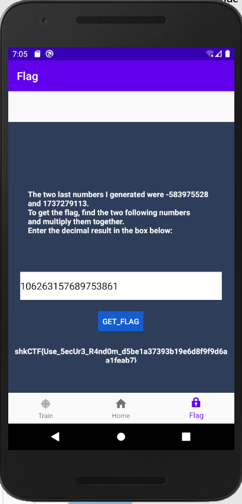

# Casino

> Get rich.

## Description

We are given an APK file. I fire [Android Studio](https://developer.android.com/studio) and run the APK on an emulator.


There are 2 relevant tabs: one for training and one for getting the flag. On the training tab, we need to guess the next number, and as we see the first result the range is quite high.

To get the flag, we need to guess the next 2 numbers.

## Solution

Let's dive into the dissassembled code (found on Android Studio by clicking on `classes.dex` and browsing the `com` folder). By displaying the bytecode, we see a few lines that catch our attention :

```
.field final synthetic val$myRandom:Ljava/util/Random;
.line 40
iget-object p1, p0, Lcom/example/casino/ui/home/HomeFragment$1;->val$myRandom:Ljava/util/Random;
invoke-virtual {p1}, Ljava/util/Random;->nextInt()I
move-result p1
int-to-long v1, p1
```

So they are actually using the `Random` from `java.util`. A quick look at the [Java doc](https://docs.oracle.com/javase/8/docs/api/java/util/Random.html) shows that:

> The class uses a 48-bit seed, which is modified using a linear congruential formula.
> 
> Instances of java.util.Random are not cryptographically secure.

So we learn that it is not secure, and it is linear so 2 numbers should allow us to deduce the state of the PRNG.

A quick Google search gives us a [working exploit](https://crypto.stackexchange.com/questions/51686/how-to-determine-the-next-number-from-javas-random-method), which I modify slightly to get the flag.

```java
import java.util.Random;

public class Casino {
    // implemented after https://docs.oracle.com/javase/7/docs/api/java/util/Random.html
    public static int next(final long seed) {
        final int bits = 32;
        final long seed2 = (seed * 0x5DEECE66DL + 0xBL) & ((1L << 48) - 1);
        return (int) (seed2 >>> (48 - bits));
    }

    public static void main(final String[] args) {
        System.out.println("Starting");
        final long i1 = -583975528L;
        final long i2 = 1737279113L;
        long seed = 0;
        for (int i = 0; i < 65536; i++) {
            seed = i1 * 65536 + i;
            if (next(seed) == i2) {
                System.out.println("Seed found: " + seed);
                break;
            }
        }
        final Random random = new Random((seed ^ 0x5DEECE66DL) & ((1L << 48) - 1));
        final int o1 = random.nextInt();
        final int o2 = random.nextInt();
        final int o3 = random.nextInt();
        final long mul = (long)o2*(long)o3;
        System.out.println("So we have that nextInt is: "+o1+" and the product one is: "+mul+" with seed: "+seed);

    }
}
```

We enter it, and we get the flag:



Flag: `shkCTF{Use_5ecUr3_R4nd0m_d5be1a37393b19e6d8f9f9d6aa1feab7}`