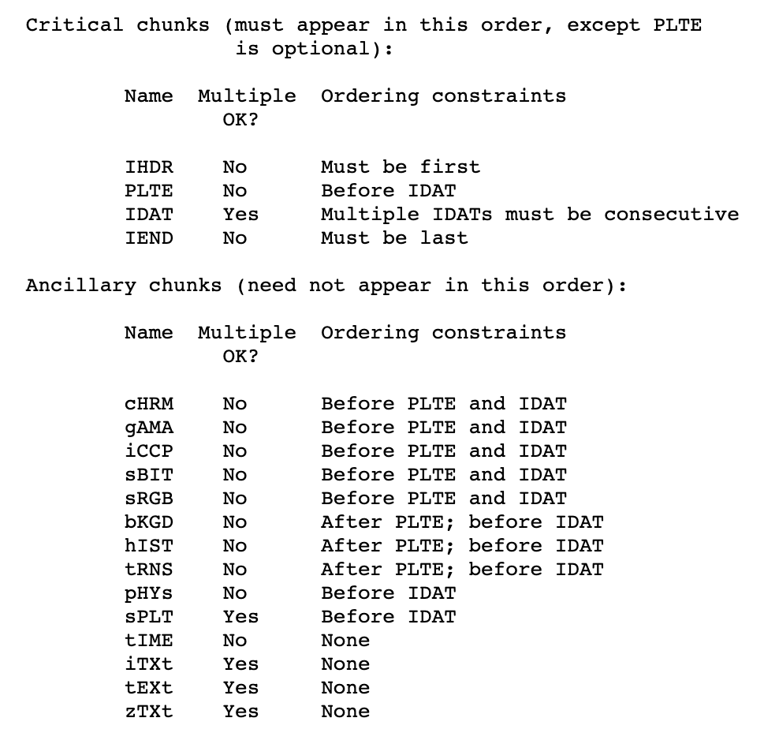

# Romance Dawn

This challenge is a forensics png reconstruction. The name of the file we get from the server is `7uffy.png` and what we are tasked with is to open it.

## First steps

First things first. A console call of pngcheck gives the following output.

```console
$ pngcheck 7uffy.png 
7uffy.png  illegal (unless recently approved) unknown, public chunk EASY
ERROR: 7uffy.png
```

If you are unaware of png files data structure, a rapid look at [this source](http://www.libpng.org/pub/png/spec/1.2/PNG-Chunks.html) tells you that there are four critical chunks in a png file (see below image).

<p align="center">	
	
</p>

These critical chunks are: IHDR, PLTE, IDAT and IEND. There is a good chance that the file `EASY` chunks need to be corrected to one of them. So let's investigate which one of these chunks are already declared in the file. PLTE is mentionned as optionnal, however, we will check for it too as one is never too sure...

## Chunk assessment.

To investigate the  do so we use the `xxd` command. Its output are then piped into `grep`, looking for the appropriate chunk name.

```console
$ xxd -g 1 7uffy.png | grep IHDR 
00000000: 89 50 4e 47 0d 0a 1a 0a 00 00 00 0d 49 48 44 52  .PNG........IHDR
$ xxd -g 1 7uffy.png | grep PLTE 
$ xxd -g 1 7uffy.png | grep IDAT 
$ xxd -g 1 7uffy.png | grep IHDR 
00000000: 89 50 4e 47 0d 0a 1a 0a 00 00 00 0d 49 48 44 52  .PNG........IHDR
```

Findings indicate that chunks IDAT are missing. So let us bet on modifying occurences of EASY to IDAT to fix the file. 

## Occurences of EASY

Before making any corrections on the file, let's have a look on the number of times EASY appear the file.

```console
$ xxd -g 1 7uffy.png | grep EASY
00000080: 64 2e 65 07 00 00 20 00 45 41 53 59 78 da ec dd  d.e... .EASYx...
00002090: 00 00 20 00 45 41 53 59 73 fd ba 35 74 86 d8 d4  .. .EASYs..5t...
000040a0: 45 41 53 59 ba 77 ef ae db 6f 56 b3 7f d8 e3 3a  EASY.w...oV....:
000060a0: b8 8e 27 4f 6e ba a5 31 00 00 0a 18 45 41 53 59  ..'On..1....EASY
```

EASY is found four times on bytes:
- 9 x 16^0 + 8 x 16 = 137
- 5 x 16^0 + 9 x 16 + 0 x 16^2 + 2 x 16^3 = 8341
- 1 x 16^0 + 10 x 16 + 0 x 16^2 + 4 x 16^3 = 16545
- 13 x 16^0 + 10 x 16 + 0 x 16^2 + 6 x 16^3 = 24749

## Making the changes.

We will thus make four calls to `dd` inputing the result of appropriate `printf` calls. `printf` calls are all the same: hex representation of EASY which is `'\x49\x44\x41\x54'`. As for the `dd` command, we will set the block size to one 
(`bs=1`) and, as we want the whole output of `printf`, we will also set the input character length to copy to 4 (`count=4`). As for the position argument, we will use the above byte position, making sure to retrieve one (`seek` is the number of bytes to jump, not the initial position).

We do not make the changes on the original file but on a copy, which we call `7uzzy_fixed.png`.

```console
$ cp 7uffy.png 7uffy_fixed.png
```

We now execute the discussed modifications.

```console
$ printf '\x49\x44\x41\x54' | dd of=7uffy_fixed.png bs=1 seek=136 count=4 conv=notrunc
4+0 records in
4+0 records out
4 bytes transferred in 0.000055 secs (72629 bytes/sec)
$ printf '\x49\x44\x41\x54' | dd of=7uffy_fixed.png bs=1 seek=8340 count=4 conv=notrunc
4+0 records in
4+0 records out
4 bytes transferred in 0.000038 secs (104858 bytes/sec)
$ printf '\x49\x44\x41\x54' | dd of=7uffy_fixed.png bs=1 seek=16544 count=4 conv=notrunc
4+0 records in
4+0 records out
4 bytes transferred in 0.000033 secs (121574 bytes/sec)
$ printf '\x49\x44\x41\x54' | dd of=7uffy_fixed.png bs=1 seek=24748 count=4 conv=notrunc
4+0 records in
4+0 records out
4 bytes transferred in 0.000035 secs (114131 bytes/sec)
```

## Outcome.

After all these efforts, let us have a look at the `pngcheck` output.

```console
$ pngcheck 7uffy_fixed.png
OK: 7uffy_fixed.png (1113x885, 32-bit RGB+alpha, non-interlaced, 99.3%).
```

Great stuff... It looks like that we have corrected the file corruption. Let's open it.

<p align="center">	
	
</p>

やった！
