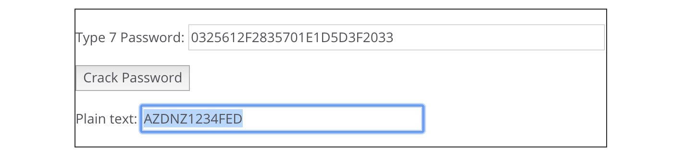
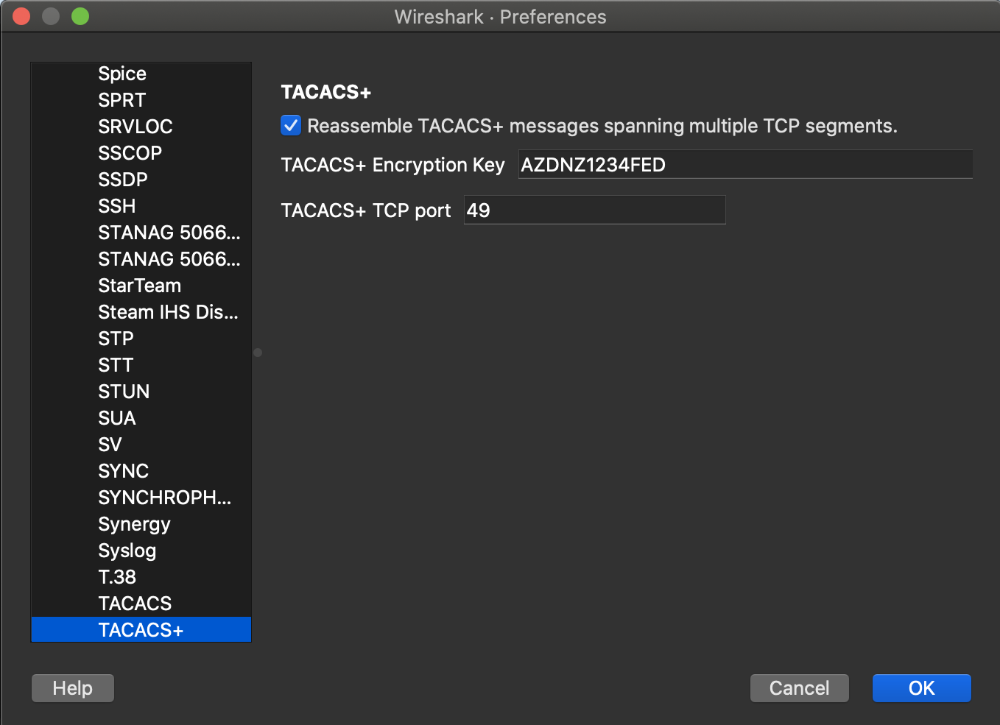
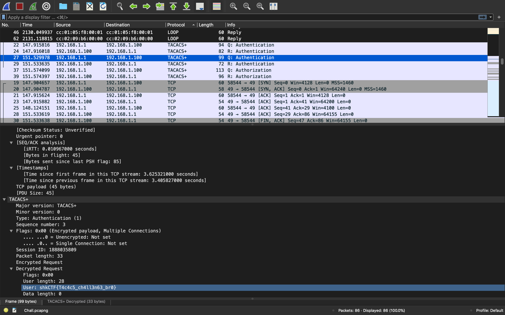

# RattataTACACS

Forensics challenge on a network communications. From the server we retrieve the file `Chall.pcapng`. These files are readable with Wireshark or tshark.

## Protocols

Using tshark we first have a look at all protocols in file.

```console
$ tshark -r Chall.pcapng -T fields -e frame.protocols | sort | uniq
eth:ethertype:arp
eth:ethertype:ip:icmp:ip:udp
eth:ethertype:ip:tcp
eth:ethertype:ip:tcp:tacplus
eth:ethertype:ip:udp:tftp
eth:ethertype:ip:udp:tftp:data
eth:ethertype:loop:data
eth:llc:cdp
```

There are 8 outputs. For those who do not know, the lines
```console
eth:ethertype:ip:tcp:tacplus
```
refer to a CISCO proprietary protocol used for identification: TACACS+. As explained in [the Wikipedia article](https://en.wikipedia.org/wiki/TACACS), "TACACS+ [...] encrypts the full content of each packet", so the first thing we are tempted to do is decrypt the content of the TACACS frame.

## Decryption of TACACS+ frames.

The TACACS+ streams are obtained with the following command
```console
$ tshark -r Chall.pcapng -T fields -e tcp.stream | sort | uniq

0
1
```

There are two streams. Let's have a look in them. For that, we need to be able to decrypt them. The UDP exchanges between 10.1.1.1 and 10.1.1.2 could contain useful information. And indeed, following the TFTP streams (Analyze > Follow > UDP Stream in wireshark), we find `tacacs-server host 192.168.1.100 key 7 0325612F2835701E1D5D3F2033` in the odd streams.

Using [this website](https://www.ifm.net.nz/cookbooks/passwordcracker.html), we can crack the key and obtain the word of the image below.




Going then into Preferences > Protocols > TACACS+, we can set the encryption key as shown below.



And scrolling throught the TACACS+ frames, we see at the third one a flag as shown below.




