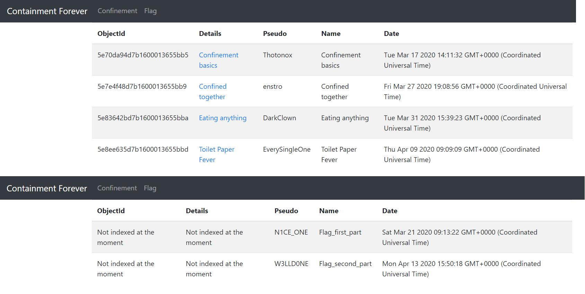
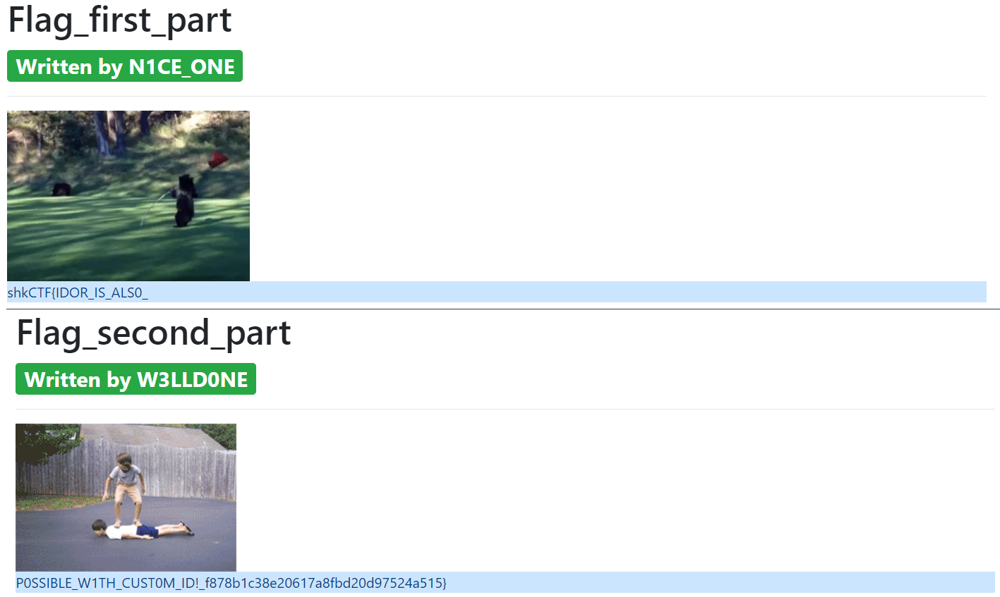

# Containment Forever

> Hello, welcome on "Containment Forever"! There are 2 categories of posts, only the first is available, get access to the posts on the flag category to retrieve the flag.
> 
> containment-forever.sharkyctf.xyz

## Description

Let's connect to the website.

As announced in the description, there are two types of posts: `Confinement` and `Flag`. Each post is characterized by five pieces of information:
- an ObjectId
- an url (in the `Details` column)
- an author
- a name
- a timestamp

We see that the id and url of the flag posts are hidden. Moreover, the url of a post with some id is `http://containment-forever.sharkyctf.xyz/item/{the id}`.

So the challenge is to understand how the id is created and deduce the flag posts ids.

## Solution

I guessed the timestamp would be included in the id, so I went to a [timestamp converter](https://www.unixtimestamp.com/index.php) and converted the dates of the confinement posts. Bingo, the first 8 characters correspond to the timestamp hex encoded.

Then we have a constant string `d7b1600013655bb`, and only the last character changes. Here I overthought it. I believed this constant string would be some hash of `confinement` and consequently I was expecting to find another constant string for `flag`. Actually... just inputting the same constant string works.

The last character I just bruteforced manually (only 16 possibilities).

Flag: `shkCTF{IDOR_IS_ALS0_P0SSIBLE_W1TH_CUST0M_ID!_f878b1c38e20617a8fbd20d97524a515}`