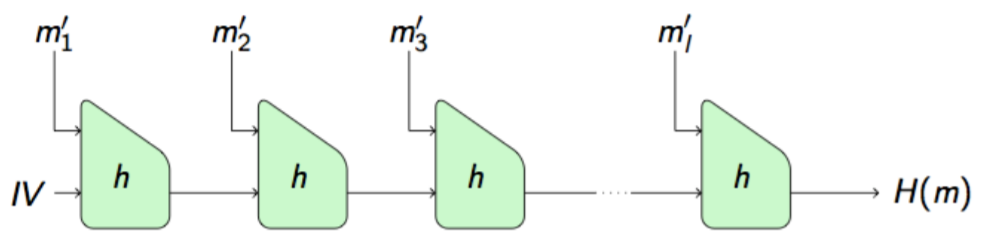

# Eternal Game

## Description

> No one has ever won my game except me!
>
> `nc challenges.tamuctf.com 8812`


The source code of the game is given:
```python
from collections import defaultdict
import random
import hashlib
import sys

x = 1
d = defaultdict(int)
game_running = True
high_score = 653086069891774904466108141306028536722619133804

def gen_hash(x):
    with open('key.txt', 'r') as f:
        key = f.read()[:-1]
        return hashlib.sha512(key + x).hexdigest()

def extract_int(s):
    i = len(s)-1
    result = 0
    while i >= 0 and s[i].isdigit():
        result *= 10
        result += ord(s[i]) - ord('0')
        i -= 1
    return result

def multiply():
    global x
    print 'Multiplier: '
    sys.stdout.flush()
    m = extract_int(raw_input())
    sys.stdout.flush()
    if m < 2 or m > 10:
        print 'Disallowed value.'
    elif d[m] == 5:
        print 'You already multiplied by ' + str(m) + ' five times!'
    else:
        x *= m
        d[m] += 1
    sys.stdout.flush()

def print_value():
    print x
    sys.stdout.flush()

def get_proof():
    global game_running
    game_running = False
    print gen_hash(str(x))
    sys.stdout.flush()

game_options = [multiply, print_value, get_proof]
def play_game():
    global game_running
    game_running = True
    print(
            '''
            Welcome the The Game. You are allowed to multiply the initial number (which is 1) by any
            number in the range 2-10. Make decisions wisely! You can only multiply by each
            number at most 5 times... so be careful. Also, at a random point during The Game, an asteroid
            will impact the Earth and The Game will be over.

            Feel free to get your proof of achievement and claim your prize at the main menu once
            you start reaching big numbers. Bet you can't beat my high score!
            '''
            )
    while game_running:
        print '1. Multiply'
        print '2. Print current value'
        print '3. Get proof and quit'
        sys.stdout.flush()
        game_options[extract_int(raw_input())-1]()
        sys.stdout.flush()
        if random.randint(1, 20) == 10:
            print 'ASTEROID!'
            game_running = False
        sys.stdout.flush()

def prize():
    print 'Input the number you reached: '
    sys.stdout.flush()
    num = raw_input()
    sys.stdout.flush()
    print 'Present the proof of your achievement: '
    sys.stdout.flush()
    proof = raw_input()
    sys.stdout.flush()
    num_hash = gen_hash(num)
    num = extract_int(num)

    if proof == num_hash:
        if num > high_score:
            with open('flag.txt', 'r') as f:
                print f.read()
        elif num > 10**18:
            print 'It sure is a good thing I wrote this in Python. Incredible!'
        elif num > 10**9:
            print 'This is becoming ridiculous... almost out of bounds on a 32 bit integer!'
        elif num > 10**6:
            print 'Into the millions!'
        elif num > 1000:
            print 'Good start!'
        else:
            print 'You can do better than that.'
    else:
        print 'Don\'t play games with me. I told you you couldn\'t beat my high score, so why are you even trying?'
    sys.stdout.flush()

def new():
    global x
    global d
    x = 1
    d = defaultdict(int)
    sys.stdout.flush()
    play_game()

main_options = [new, prize, exit]

def main_menu():
    print '1. New Game'
    print '2. Claim Prize'
    print '3. Exit'
    sys.stdout.flush()
    main_options[extract_int(raw_input())-1]()
    sys.stdout.flush()

if __name__ == '__main__':
    while True:
        main_menu()
```

## Solution

From the python script we understand easily what happens. The game rules are as follow:

- begin with a score of `x = 1`
- for each round, choose an integer between 2 and 10. Every integer can be chosen at most 5 times. Then the value `x` is multiplied by the chosen value.
- when we want to end the game, the game give us a proof that we have reached the value `x` in the game.
- to get the flag, we need to input a value greater than `653086069891774904466108141306028536722619133804` and have a proof that we reached this state.

We quickly discover that winning the game by playing by the rules is not possible, as `(10!)^5` is below the score to reach.

Moreover, we cannot cheat the game itself by inserting values outside the [2,10] range (or non integer values), as the program uses the `extract_int` function to read inputs. 

For some strange reason, their function is not well implemented, and it reads the string input from right to left constructing the corresponding integer until it reached a non numeral character (therefore we need to enter 01 for the game to understand 10).

Therefore the way to cheat the game is to select a value, then forge a proof matching the entered number. Let's have a closer look at the proof function:

```python
def prize():
    print 'Input the number you reached: '
    sys.stdout.flush()
    num = raw_input()
    sys.stdout.flush()
    print 'Present the proof of your achievement: '
    sys.stdout.flush()
    proof = raw_input()
    sys.stdout.flush()
    num_hash = gen_hash(num)
    num = extract_int(num)

    if proof == num_hash:
        if num > high_score:
            with open('flag.txt', 'r') as f:
                print f.read()
        # Other not interesting cases
    else:
        print 'Don\'t play games with me. I told you you couldn\'t beat my high score, so why are you even trying?'
    sys.stdout.flush()
```

So we enter a string `num`, then a string `proof`, and we get the flag if `gen_hash(num) == proof` and `extract_int(num) > high_score`.

Note that `gen_hash(num)` takes the raw input as input, and the integer is extracted after that. Therefore we need to choose a string `s` such that we can craft a corresponding proof for `s` and that `extract_int(s) > high_score`.

In order to craft a valid proof, we look more precisely at the `gen_hash` function:

```python
def gen_hash(x):
    with open('key.txt', 'r') as f:
        key = f.read()[:-1]
        return hashlib.sha512(key + x).hexdigest()
```

So the proof is created by appending our string to a secret key, and returning the hash (with function SHA512). SHA512 is a variant of the [SHA-2](https://en.wikipedia.org/wiki/SHA-2) hash function, which is based on the [Merkle–Damgård construction](https://en.wikipedia.org/wiki/Merkle%E2%80%93Damg%C3%A5rd_construction)! And this construction is vulnerable to length extension attacks. As we choose the value that is appended after the secret, we'll be able to carry out a length extension attack.

### Length extension attack

The Merkle–Damgård construction works as follows. Given a compression function `h`, taking as input a message block of size `n` and an input of size `k`, it outputs a digest of size `k`.
- it takes as input a message `m`
- it pads it to a correct number of bits which is a multiple of `n`
- then it creates the hash using the algorithm described in the following picture. In words, it gives the previous output and the next message block to the compression function, and outputs the next output (first input for the compression function is a constant IV).



In the special case of SHA512, `n = 1024` and `k = 512`.

Now, if there is some unknown message `m` such that we know `H(m)`, then we can iterate the construction (by adding blocks with the compression function, with `H(m)` as first input), in order to create a correct hash for message `m || pad(m) || m'` for any chosen message `m'`.

### Back to the concrete attack

Here in this case, we know the hash ```H(key || x)``` where `x` is a number we can reach in the game. For simplicity, let's take `x = 1`.

So the attack is to use length extension attack to create a valid hash `H(key || x || pad(key || x) || y)`, which will be our proof for the string `x || pad(key || x) || y`. If we choose `y` sufficiently large, then the `extract_int` function will extract a sufficiently large integer to get the flag.

So we have `x = 1`  and we choose `y`, so we can already craft a proof for our string.

But we need to be able to know `pad(key || x)` in order to build the actual string! The padding procedure for a message `m` works as follow:
- encode `|m|` (the bit length of `m`) as a `k` bit integer.
- append a bit `1` to `m`.
- add a sufficient number of zeros between this bit `1` and the `k`-bit string encoding the length of the message, such that the result is a multiple of `n` (block length).
Therefore `pad(m) = 1 || 0...0 || len(m)` with `len(m)` being `k` bits and the number of `0` enough to reach a multiple of `n` bits.

For SHA512, `k = 128`.

The problem is that in this case, `m = key || 1`, but we do not know the length of key! Therefore we will bruteforce the length of the key, and the game will answer with "Don't play games with me. I told you you couldn't beat my high score, so why are you even trying?" if we don't get the length right (as the hash will be false).

## Implementation of the attack

We're using [hlextend](https://github.com/stephenbradshaw/hlextend) to carry out the length extension attack. The following code shows the attack.

```python
import hlextend
from pwn import *

# This hash is H(key || 1)
original_hash = "a17b713167841563563ac6903a8bd44801be3c0fb81b086a4816ea457f8c829a6d5d785b49161972b7e94ff9790d37311e12b32221380041a99c16d765e8776c"
# This is a big enough score to win (written in reverse order)
score = "6530860698917749044661081413060285367226191338057"

# Init algorithm with SHA512
sha = hlextend.new('sha512')

# Connect to service
sh = remote('challenges.tamuctf.com', 8812)

#Brute force key size (number of characters)
for key_size in range(1, 100):
    sh.recvuntil("Exit")

    sh.sendline("2")
    sh.recvuntil("reached:")

    # Create 128-bit part of the pad holding len(key || x). The len is the size in bits, so we need to multiply by 8.
    originalHashLength = bin((key_size+len("1")) * 8)[2:].rjust(128, "0")

    # Select the correct number of zeroes in the pad. We need to have |key|*8 + 1*8 + 1 + t + 128 multiple of 1024.
    t = 1024 - key_size*8 - 8 - 1 -128
    if t<0:
        t+=1024
    # This is the padding: bit 1, then t zeroes, then the 128 bits for the length
    bitString = '0b1' + '0'*t + originalHashLength
    bitString = int(bitString, 2)

    # Our payload (string s) is x || pad(key || x) || y
    # Here x is '1', we have just computed the pad, and y is our big number.
    num = b"1" + bitString.to_bytes((bitString.bit_length() + 7) // 8, 'big') + score.encode()
    sh.sendline(num)

    sh.recvuntil("achievement:")
    # Now we send the hash using length extension
    # score is the added payload, "1" is known hash, key_size is the size of unknown input and original_hash is the hash gotten from the server.
    sha.extend(score, '1', key_size, original_hash)
    sh.sendline(sha.hexdigest())

    # Get response from server
    result = ""
    while len(result) <= 6: 
        result = sh.recvline()
    print(key_size, result)
    if b"gigem" in result:
        break
```

Flag: `gigem{a11_uR_h4sH_rR_be10nG_to_m3Ee3}`
