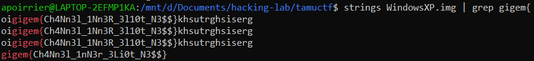

# Al Capone

## Description

> Eliot Ness is the lead on taking down Al Capone. He has gained access to Capone's personal computer but being the good detective he is, he got the disk image of the computer rather than look through the actual computer. Can you help Ness out and find any information to take down the mob boss?
> 
> (hint: Al Capone knew his computer was going to be taken soon, so he deleted all important data to ensure no one could see it. Little did he know that Ness was smarter than him.)
> 
> Direct Download link: https://tamuctf.com/themes/core/static/img/WindowsXP.img.xz

## Solution

Once we download the image, use `strings` on it.

Flag: `gigem{Ch4Nn3l_1nN3r_3Li0t_N3$$}`

(Funny authors tried to prevent people from doing this by inserting a lot of `gigem` strings, but no `gigem{` string).