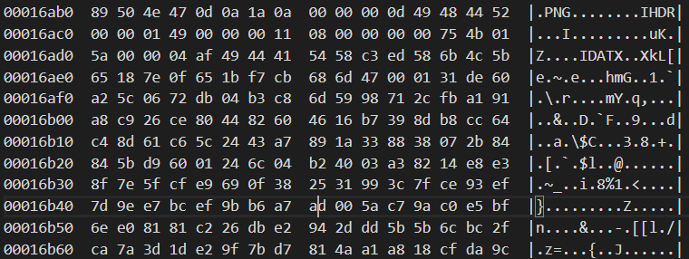

# Corruped Disk

## Description

> We've recovered this disk image but it seems to be damaged. Can you recover any useful information from it?

A `.img` disk is given with the challenge.

## Solution

First let's perform simple forensics. Let's try to mount the image. It fails (as the decription says, the disk is corrupted).
Using `strings`, we find the string `flag.png`, as well as other filenames. Sadly, `binwalk` does not seem to be able to recover relevant files...

Then by using  `hexdump` and analysing the output, I retrieve two chunks which look like PNG files (which can be recognized as their magic number, which translate as `.PNG` in ASCII). We also recognize the IHDR block, also a value to be found in PNG files.



So let's try to extract this block, from the `.PNG` magic number to IEND. For this example, this correspond to bytes from `0x16ab0` to `0x16fa0`. 
Let's use this simple Python script:

```python
with open('recovered_disk.img', 'rb') as f:
    with open('flag.png', 'wb') as g:
        f.seek(0x16ab0, 0)
        data = f.read(0xfa0 - 0xab0)
        g.write(data)
```

This gives us `flag.png`:


Flag: `gigem{wh3r3_w3r3_601n6_w3_d0n7_n33d_h34d3r5}`