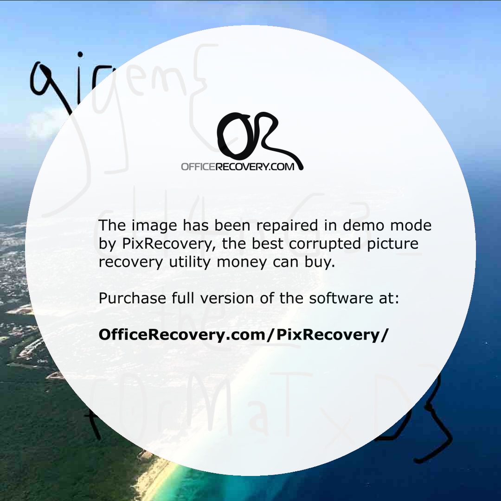

# Instagram

## Description

> I need a hacker please!!! My photo was going to get thousands of likes, but it was corrupted 😩.

Given is a file photo.png.

## Solution

Using ```file photo.png```, we see this is actually a jpeg image. Yet is seems broken. ```binwalk``` doesn't reveal anything, nor does ```strings``` or ```binwalk```, so I've tried an online [JPEG Recovery tool](https://online.officerecovery.com/).

Bingo, this gives me this image (with an ugly watermark).


Flag: gigem{ch4nG3_the_f0rMaTxD}