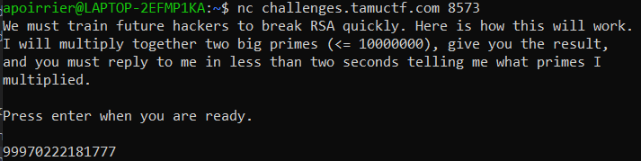

# RSA PWN

## Description

> We must train the next generation of hackers.
>
> nc challenges.tamuctf.com 8573

## Solution

When we connect to the server, the following happens:


2 seconds is quite much for factorization, so a simple Python script should do the trick.

```python
from pwn import *

sh = remote('challenges.tamuctf.com', 8573)
print(sh.recvuntil("Press enter when you are ready."))
sh.sendline("")
print(sh.recvline())
n = int(sh.recvline())
print(n)

for i in range(3,n//2,2):
    if n % i == 0:
        s = " ".join([str(i), str(n//i)])
        sh.sendline(s.encode())
        print(s)
        break

sh.interactive()
```

Flag: gigem{g00d_job_yOu_h4aaxx0rrR}