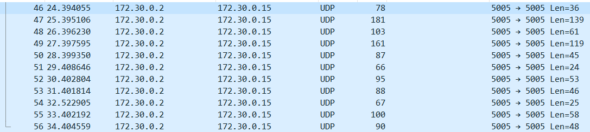

# Listen

## Description

Attached is an OpenVPN config file

## Solution

Download [OpenVPN](https://openvpn.net/community-downloads/).Then right click on the icon in the tray bar and add the config file. Then connect to the VPN.

As the challenge is called listen, I have just opened [Wireshark](https://www.wireshark.org/) and listen on the VPN interface card. After waiting a little bit I get several UDP packets.



By clicking Analyse -> Follow -> UDP flow, I retrieve the flag:
```
-----------------------------------------------------------------------------------------------------
INT. WHITE HOUSE -CONFERENCE ROOM -DAY
Joe meets with the CABINET MEMBERS. He looks frustrated, like this has been going on a while.
JOE - Once again, I'm pretty sure all that Rauncho stuff might be what's killing the plants.
SECRETARY OF DEFENSE - But Rauncho's got what plants crave. It's got electrolytes.
ATTORNEY GENERAL - (thinking painfully hard)So wait a minute... You're saying you want us to put water on the crops?  Water? Like out of the toilet?
JOE - It doesn't have to be from the toilet, but yes, that's the idea.
SECRETARY OF DEFENSE - Okay, but Rauncho's got what plants crave.
ATTORNEY GENERAL - It's got electrolytes.
JOE - Look, your plants aren't growing. So I'm pretty sure the Rauncho's not working. Now I'm no botanist, but I do know that if you put water on plants they grow.
14-YEAR-OLD - Like from the toilet?
JOE - Look, you want to solve this problem, I want to get my pardon.  So why don't we try it, and stop worrying about what "plants crave."
ATTORNEY GENERAL - (helpful)Rauncho's got what plants crave.
SECRETARY OF DEFENSE - Yeah, it's like the commercial says, "Plants work hard, and they need a drink that works hard."
14-YEAR-OLD - Oh, and it's got electrolytes.
Joe's about to lose it.
JOE - What areelectrolytes?  Does anyone even know?!
ATTORNEY GENERAL - They're what's in Rauncho.
JOE - But what are they?
ATTORNEY GENERAL - They're what they use to make Rauncho.
JOE - But why do they use them to make Rauncho?
SECRETARY OF DEFENSE - Cuz gigem{Raunch05_got_el3ctr0lytes}
Suddenly, the automated sprinkler system comes on.
Joe looks at the drops on his arms, notices they're green
JOE - What is this?
RITA - (tasting it) 
RITA - Is it that gatorade stuff?
They look up and see a giant tank/water-tower with the Rauncho logo. 
It says "RAUNCHO'S GOT WHAT PLANTS CRAVE," and "WITH ELECTROLYTES."
RITA - They're watering plants with that shit?
Joe looks around, sees acres and acres of crops being watered with Rauncho, getting an idea.
```

Flag: gigem{Raunch05_got_el3ctr0lytes}