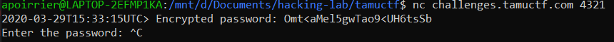

# About Time

## Description
> Let's see if you can figure out this password..
> 
> Use the following command to connect to the server and interact with the binary!
> 
> `nc challenges.tamuctf.com 4321`

Tha binary corresponding to the service is provided.

## Solution

Let's connect to the service.



So we get the current time, an encrypted password, and we need to enter the password. We need to understand how the password is encrypted.

Let's reverse the code using [Ghidra](https://ghidra-sre.org/).

Ghidra doesn't recognize the main function, but there is an `entry` function calling `FUN_001015c7`, so we'll assume this is the main function. Its code is the following:

```c
undefined8 FUN_001015c7(void)

{
  uint uVar1;
  int iVar2;
  time_t tVar3;
  size_t sVar4;
  long in_FS_OFFSET;
  int local_9c;
  int local_98;
  time_t local_90;
  tm *local_88;
  FILE *local_80;
  code *local_78 [3];
  char local_5d [5];
  char local_58 [56];
  long local_20;
  
  local_20 = *(long *)(in_FS_OFFSET + 0x28);
  signal(0xe,FUN_00101569);
  alarm(5);
  tVar3 = time((time_t *)0x0);
  srand((uint)tVar3);
  local_90 = time((time_t *)0x0);
  local_88 = localtime(&local_90);
  strftime(local_58,0x32,"%Y-%m-%dT%H:%M:%S%Z",local_88);
  strftime(local_5d,5,"%M",local_88);
  iVar2 = atoi(local_5d);
  iVar2 = iVar2 % 6;
  uVar1 = iVar2 + 2;
  DAT_00104100 = uVar1;
  local_80 = fopen("flag.txt","r");
  if (local_80 == (FILE *)0x0) {
    puts("Flag.txt not found. Exiting...");
  }
  else {
    fgets(&DAT_00104080,0x32,local_80);
    fclose(local_80);
    local_9c = 0;
    while( true ) {
      sVar4 = strlen(&DAT_00104080);
      if (sVar4 <= (ulong)(long)local_9c) break;
      if ((&DAT_00104080)[local_9c] == '\n') {
        (&DAT_00104080)[local_9c] = 0;
      }
      local_9c = local_9c + 1;
    }
    strncpy(&DAT_001040c0,&DAT_00104080,0x32);
    local_78[0] = FUN_001012a9;
    local_78[1] = FUN_001013dd;
    local_78[2] = FUN_00101473;
    (*local_78[(int)uVar1 % 3])(&DAT_001040c0,(ulong)uVar1,local_78[(int)uVar1 % 3]);
    (*local_78[(iVar2 + 3) % 3])(&DAT_001040c0,(ulong)uVar1,local_78[(iVar2 + 3) % 3]);
    (*local_78[(iVar2 + 4) % 3])(&DAT_001040c0,(ulong)uVar1,local_78[(iVar2 + 4) % 3]);
    printf("%s> Encrypted password: %s\n",local_58,&DAT_001040c0);
    fflush(stdout);
    printf("Enter the password: ");
    fflush(stdout);
    fgets(&DAT_00104104,0x32,stdin);
    local_98 = 0;
    while( true ) {
      sVar4 = strlen(&DAT_00104104);
      if (sVar4 <= (ulong)(long)local_98) break;
      if ((&DAT_00104104)[local_98] == '\n') {
        (&DAT_00104104)[local_98] = 0;
      }
      local_98 = local_98 + 1;
    }
    (*local_78[(int)uVar1 % 3])(&DAT_00104104,(ulong)uVar1,local_78[(int)uVar1 % 3]);
    (*local_78[(iVar2 + 3) % 3])(&DAT_00104104,(ulong)uVar1,local_78[(iVar2 + 3) % 3]);
    (*local_78[(iVar2 + 4) % 3])(&DAT_00104104,(ulong)uVar1,local_78[(iVar2 + 4) % 3]);
    FUN_001014fb(&DAT_001040c0,&DAT_00104104);
  }
  if (local_20 != *(long *)(in_FS_OFFSET + 0x28)) {
                    /* WARNING: Subroutine does not return */
    __stack_chk_fail();
  }
  return 0;
}
```

Let's see in detail what this program does.

```c
  signal(0xe,FUN_00101569);
  alarm(5);
```

First it sets an alarm in 5 seconds, and this alarm triggers `FUN_00101569`. This function basically sets some data blocks to 0 with probability 1/2.

```c
  tVar3 = time((time_t *)0x0);
  srand((uint)tVar3);
  local_90 = time((time_t *)0x0);
  local_88 = localtime(&local_90);
  strftime(local_58,0x32,"%Y-%m-%dT%H:%M:%S%Z",local_88);
  strftime(local_5d,5,"%M",local_88);
  iVar2 = atoi(local_5d);
  iVar2 = iVar2 % 6;
  uVar1 = iVar2 + 2;
  DAT_00104100 = uVar1;
```

So the pseudo random generator is initialized with current time, then time is called once more and its format is set in `local_58`. Then two variables are set: 
- `iVar2` is current minute mod 6
- `DAT_00104100 = uVar1` is `iVar2 + 2`.

```c
  local_80 = fopen("flag.txt","r");
  if (local_80 == (FILE *)0x0) {
    puts("Flag.txt not found. Exiting...");
  }
  else {
    fgets(&DAT_00104080,0x32,local_80);
    fclose(local_80);
```

Read content of `flag.txt` and put it in `DAT_00104080`.

```c
    local_9c = 0;
    while( true ) {
      sVar4 = strlen(&DAT_00104080);
      if (sVar4 <= (ulong)(long)local_9c) break;
      if ((&DAT_00104080)[local_9c] == '\n') {
        (&DAT_00104080)[local_9c] = 0;
      }
      local_9c = local_9c + 1;
    }
```

Replace any `\n` in the flag by `0`.

```c
    strncpy(&DAT_001040c0,&DAT_00104080,0x32);
    local_78[0] = FUN_001012a9;
    local_78[1] = FUN_001013dd;
    local_78[2] = FUN_00101473;
    (*local_78[(int)uVar1 % 3])(&DAT_001040c0,(ulong)uVar1,local_78[(int)uVar1 % 3]);
    (*local_78[(iVar2 + 3) % 3])(&DAT_001040c0,(ulong)uVar1,local_78[(iVar2 + 3) % 3]);
    (*local_78[(iVar2 + 4) % 3])(&DAT_001040c0,(ulong)uVar1,local_78[(iVar2 + 4) % 3]);
    printf("%s> Encrypted password: %s\n",local_58,&DAT_001040c0);
    fflush(stdout);
```

Now things get interesting. First, copy the flag in `DAT_001040c0`. Then, 3 functions are saved in `local_78`, which is an array of function pointers. Then those functions are called in an order defined by the current minute (using `iVar2` and `uVar1`), with `DAT_001040c0` and `uVar1` as parameter. This is the encrypted password which is then displayed to the user.

```c
    fgets(&DAT_00104104,0x32,stdin);
    local_98 = 0;
    while( true ) {
      sVar4 = strlen(&DAT_00104104);
      if (sVar4 <= (ulong)(long)local_98) break;
      if ((&DAT_00104104)[local_98] == '\n') {
        (&DAT_00104104)[local_98] = 0;
      }
      local_98 = local_98 + 1;
    }
    (*local_78[(int)uVar1 % 3])(&DAT_00104104,(ulong)uVar1,local_78[(int)uVar1 % 3]);
    (*local_78[(iVar2 + 3) % 3])(&DAT_00104104,(ulong)uVar1,local_78[(iVar2 + 3) % 3]);
    (*local_78[(iVar2 + 4) % 3])(&DAT_00104104,(ulong)uVar1,local_78[(iVar2 + 4) % 3]);
    FUN_001014fb(&DAT_001040c0,&DAT_00104104);
```

Rest of the code is similar as above: the user inputs some password, which is then transformed as the flag, and both get compared in `FUN_001014fb` (which just prints `gigem{password}` if the password is correct).

So we need to understand what the three functions in `local_78` do. As the time used to compute the minute is given, we know the order those functions are called. We also know the `uVar1` parameter.

Let's describe the 3 functions. 

**Function 0**:

```c
void FUN_001012a9(char *param_1,int param_2)
{
  int iVar1;
  size_t sVar2;
  int local_1c;
  
  local_1c = 0;
  while( true ) {
    sVar2 = strlen(param_1);
    if (sVar2 <= (ulong)(long)local_1c) break;
    if (('`' < param_1[local_1c]) && (param_1[local_1c] < '{')) {
      iVar1 = param_2 + (int)param_1[local_1c] + 0x54;
      param_1[local_1c] = (char)iVar1 + (char)(iVar1 / 0x1a) * -0x1a + 'a';
    }
    if (('@' < param_1[local_1c]) && (param_1[local_1c] < '[')) {
      iVar1 = param_2 + (int)param_1[local_1c] + -0x34;
      param_1[local_1c] = (char)iVar1 + (char)(iVar1 / 0x1a) * -0x1a + 'A';
    }
    local_1c = local_1c + 3;
  }
  return;
}
```

For characters `0, 3, ...` in the input string, it first checks wether it is a lowercase letter. If that is the case, it tranforms it using the following transformation:

```c
y = minutes + input[i] + 0x54
input[i] = remainder(y, 0x1a) + 'a'.
```

where `minutes` is the second parameter given to the function (derived in main from current minute), `input[i]` is the current character, and `remainder(y, 0x1a)` returns the remainder of the euclidian division of `y` by `0x1a`.

Then a second check happens: if `input[i]` is between `@` and `[`, then another similar computation is performed:

```c
y = minutes + input[i] - 0x34
input[i] = remainder(y, 0x1a) + 'A'.
```

So let's try to invert this.

First check: it checks if the input is a lowercase letter, and it outputs also a modified lowercase letter. We actually have `input[i] = 'a' + (input[i] + cst) % 26` with `cst` a constant depending of `minutes`.

The same reasoning can be performed with the second check but with uppercase. 

Therefore we can reverse the function:

```python
def fun0(flag, minutes):
    for i in range(0, len(flag), 3):
        if flag[i] in 'ABCDEFGHIJKLMNOPQRSTUVWXYZ':
            y = ord(flag[i])
            y = y + 0x34 - minutes
            y %= 26
            flag[i] = chr(ord('A') + y)
        if flag[i] in 'abcdefghijklmnopqrstuvwxyz':
            y = ord(flag[i])
            y = y - 0x54 - minutes
            y %= 26
            flag[i] = chr(ord('a') + y)
    return flag
```

**Function 1**:

```c
void FUN_001013dd(char *param_1,int param_2)
{
  size_t sVar1;
  long in_FS_OFFSET;
  int local_50;
  char local_48 [56];
  long local_10;
  
  local_10 = *(long *)(in_FS_OFFSET + 0x28);
  strncpy(local_48,param_1,0x32);
  sVar1 = strlen(param_1);
  local_50 = 0;
  while (local_50 < (int)sVar1) {
    param_1[local_50] = local_48[(param_2 + local_50) % (int)sVar1];
    local_50 = local_50 + 1;
  }
  if (local_10 != *(long *)(in_FS_OFFSET + 0x28)) {
                    /* WARNING: Subroutine does not return */
    __stack_chk_fail();
  }
  return;
}
```

This function is easier to understand. The input is copied to `local_48` then the operation performed is `input[i] = local48[(minutes + i)%n]`. This Python function reverses the function:

```python
def fun1(flag, minutes):
    return [flag[(i - minutes) % len(flag)] for i in range(len(flag))]
```

**Function 2* is also easier:

```c
void FUN_00101473(char *param_1,char param_2)
{
  size_t sVar1;
  int local_10;
  
  sVar1 = strlen(param_1);
  local_10 = 0;
  while (local_10 < (int)sVar1) {
    if (('/' < param_1[local_10]) && (param_1[local_10] < ':')) {
      param_1[local_10] = param_1[local_10] + param_2;
    }
    local_10 = local_10 + 1;
  }
  return;
}
```

For all charachter in the input, if it is a number, add `minutes` to it.

```python
def fun2(flag, minutes):
    for i in range(len(flag)):
        if ord(flag[i]) - minutes > ord('/') and ord(flag[i]) - minutes < ord(':'):
            flag[i] = chr(ord(flag[i]) - minutes)
    return flag
```

We can then combine those functions to get the flag:

```python
fun = [fun0, fun1, fun2]

if __name__ == "__main__":
    minutes = int(sys.argv[1])
    flag = list(sys.argv[2])
    minutes = minutes % 6
    mod_min = minutes + 2
    flag = fun[(minutes + 4) % 3](flag, mod_min)
    flag = fun[(minutes + 3) % 3](flag, mod_min)
    flag = fun[(mod_min) % 3](flag, mod_min)
    print(''.join(flag))
```

And launch this program with 2 arguments: the minute given by the server, and the encrypted password.

Flag: `gigem{1tsAbOut7iMet0geTaw47CH}`