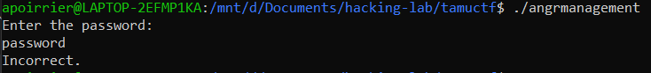

# Angr Management

## Description

> `nc challenges.tamuctf.com 4322`

The binary is provided.

## Solution

This challenge asks for a password, and checks it.

By reversing the code, we see that the password is sent to 32 functions which check if it is correct or not. Each function can be easily reversed, consists mainly of simple mathematical conditions on the password. So as first function gives us the expected length of the string, we can start with a 32 characters string with all `a`, then mutate it when some verification fails.

This method is clearly not the best one, it is quite long and time consuming, but in the end we managed to find correct constraints on our string.

We use gdb to know at which function the verification fails:
- `b *addr` sets a breakpoint at the label where the code jumps when verification has failed
- `record` at the beginning of the program allows to use `reverse-nexti` to get back in the execution.

Finally we find the password and the flag.

Flag: `gigem{4n63r_m4n463m3n7}`