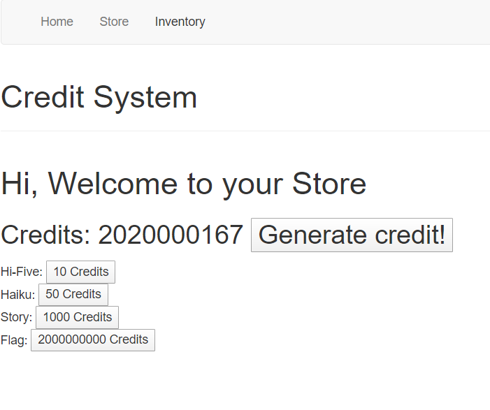
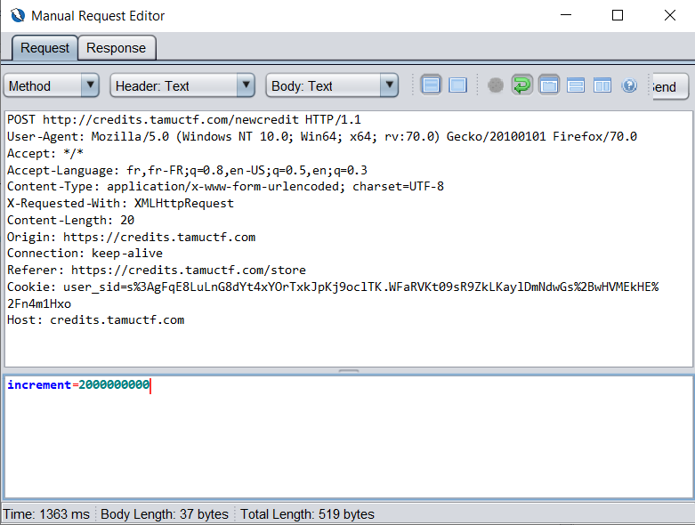

# Credits

## Description

> Try testing out this new credit system that I just created!
> 
> http://credits.tamuctf.com/
> 
> Hint: Credit generation is rate limited. It is literally impossible to generate 2,000,000,000 credits within the CTF timeframe. Don't be that guy.

## Solution

Once we log in, we have access to the credit system depicted above. The `Generate credit!` button increases our credit by 1, and then we can buy some texts. The flag can be bought with enough credits.

Clicking on the `Generate credit!` button sends a post request with `increment=1`. We can use [OWASP ZAP](https://www.zaproxy.org/) to send the request but by changing the `increment` parameter.

Finally we can buy the flag.

Flag: `gigem{serverside_53rv3r5163_SerVeRSide}`