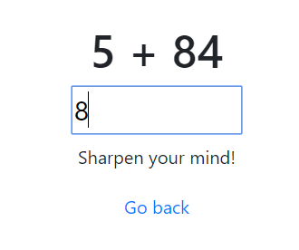

# Mental Math

## Description

> My first web app, check it out!
>
> http://mentalmath.tamuctf.com
>
> Hint: I don't believe in giving prizes for solving questions, no matter how many!



## Solution

The website is a simple webapp where simple math challenges are given. We may answer them by typing the response in the corresponding field, and when the answer is correct, the problem changes.

Using the inspector (on Chrome: `Right click` -> `Inspect`), we can see the source code of the page.

```html
<!doctype html>

<html lang="en">
  <head>
    <meta charset="utf-8">

    <title>mEnTaL MaTh</title>
    <meta name="description" content="A game for the wise.">
    <meta name="author" content="Arithmetic King">

    <!--% block css %}{% endblock %-->

    <link rel="stylesheet" href="https://maxcdn.bootstrapcdn.com/bootstrap/4.0.0/css/bootstrap.min.css" integrity="sha384-Gn5384xqQ1aoWXA+058RXPxPg6fy4IWvTNh0E263XmFcJlSAwiGgFAW/dAiS6JXm" crossorigin="anonymous">
  </head>

  <body>
    <script src="https://ajax.googleapis.com/ajax/libs/jquery/3.4.1/jquery.min.js"></script> 
    <div class="container">
      

<div class="row mt-5">
  <div class="col-sm-12 text-center"> <h1 id="problem"></h1> </div>
  <div class="col-sm-12 text-center"> <input name="answer" type="text" style="font-size: 24px; width: 150px;" id="answer"> </div>
</div>

<div class="row mt-2">
  <div class="col-sm-12 text-center"><p>Sharpen your mind!</p></div>
</div>

<div class="row mt-1">
  <div class="col-sm-12 text-center"><a href="/">Go back</a></div>
</div>

<script>
  function submitProblem() {
    $.post("/ajax/new_problem", {'problem': $("#problem").html(), 'answer': $('#answer').val()}, function ( data ) {
      if (data.correct) {
        $('#problem').html(data.problem);
        $('#answer').val('');
      }
    });
  }

$(document).ready(function() {
  $("#answer").on('input', submitProblem);
  submitProblem();
});
</script>


    </div>
  </body>
</html>
```

We can see the simple javascript which sends our answers to the backend: it makes an API call to the endpoint `/ajax/new_problem`, POSTing the current problem and the answer as data. The backend verifies the challenge, and if it is correct, it sends back `correct: true` along with a new problem.

Let's try to modify the POST data using [OWASP ZAP](https://www.zaproxy.org/). Once ZAP is open, click on the firefox icon in the toolbar. Firefox opens and we can connect to the website. Then let's try to enter something in the answer field. This should send a POST request.

Then in the `History` tab, we look for the POST request, and here it is. Right click on it and choose `Resend with Request Editor`.

Here we may play with parameters. Putting a random string in the answer or the problem gives us a server error response (error 500). So the backend probably directly interpret our input without sanitization: we have our vulnerability!

Let's try to exploit it. As the challenge is sent along with the request, probably the backend is stateless. Moreover sending a string as an answer gives a server error, so it is probably casted as in integer. 

Injecting while the input is cast as an integer seems difficult, so we concentrate on injecting the `problem` part. As the challenge needs to be verified, the backend probably uses some sort of evaluation function, such as `eval` from Python. So let's check which backend we have: 

First I try `true` and `True`. `true` returns an error 500, while `True` returns correct, so probably the backend is in Python.

The injection we have found is the following:
```python
ord(open("flag.txt","r").read()[0])
```

We check it, and it works! So there is a file `flag.txt` on the server. Moreover we can verify its first character is `g`. To continue the exploit, we have used the ZAP Proxy fuzzer, to bruteforce each character of the flag. This finally gives us the flag.

Flag: `gigem{1_4m_g0od_47_m4tH3m4aatics_n07_s3cUr1ty_h3h3h3he}`