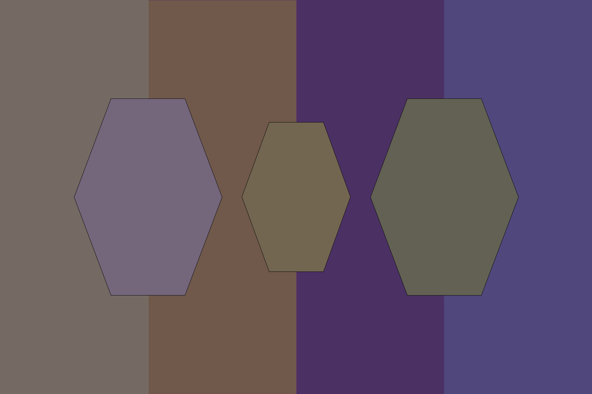
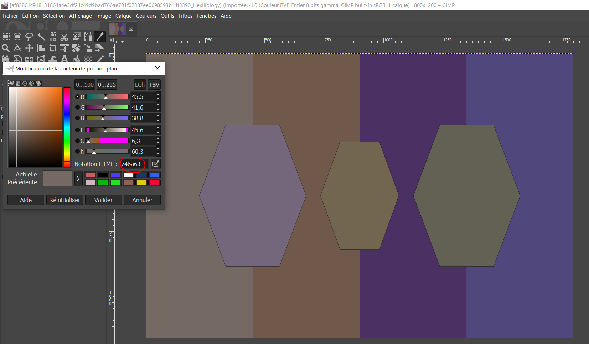

# Hexillogy 

> I recently designed a new flag for my imaginary nation, Hexistan. Do you like it?

## Solution

From the name of the challenge, we guess the flag is encoded in the colors of the image. So I open my favorite editor (such as [Gimp](https://www.gimp.org/downloads/)) and use the color picker to get the hex encoded color values.

Then I put them in [asciitohex](https://www.asciitohex.com/) and here is the flag.

Flag: `tjctf{pYJrfQK0dbaTPG}`