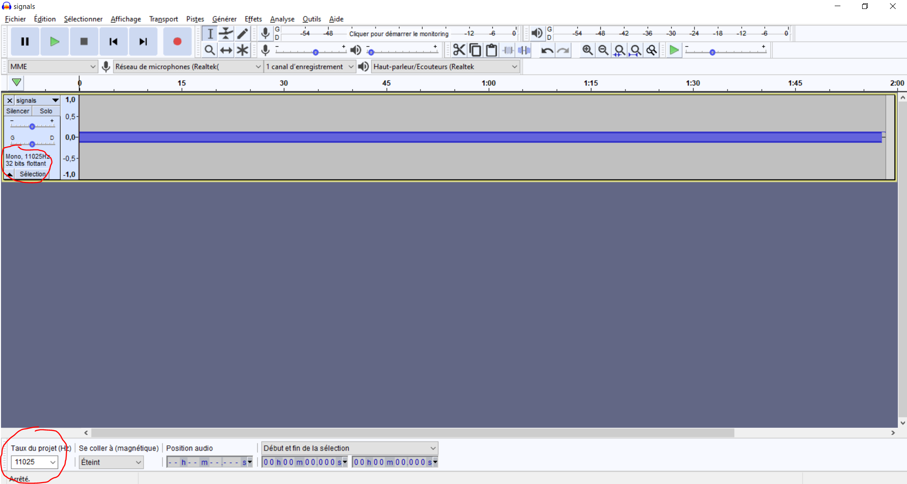
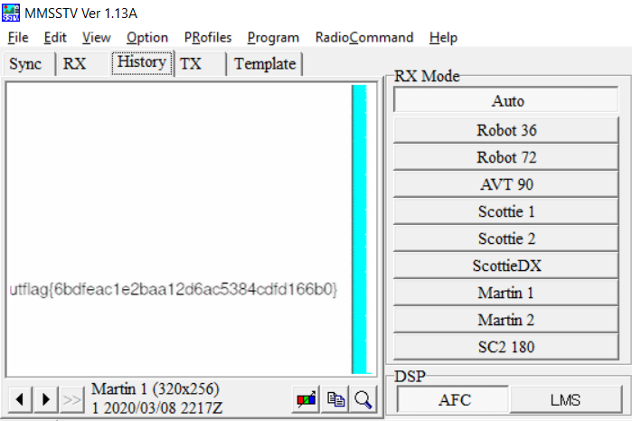

# 1 Frame per Minute
Forensics

## Description

> I recently received this signal transmission known as SSTV in a mode called Martian? This technology is all very old so I'm not sure what to do with it. Could you help me out?

Attached is a wav file.

## Solution
Thanks to the description and by listening to the file, I have recognised an [SSTV](https://en.wikipedia.org/wiki/Slow-scan_television) transmission. There is an image hidden in this file.

To retrieve it, I have used [MMSSTV](https://hamsoft.ca/pages/mmsstv.php) to decode it.

MMSSTV only accepts .mmv input files. But `.mmv` files are just `.wav` files in mono with a frequency of 11.025 kHz. So I open [Audacity](https://www.audacityteam.org/) first to convert the `.wav` file.

The important parameters are the sampling frequency to put to 11025 Hz, then change from stereo to mono (`Tracks` -> `Mix` -> `Stereo to Mono`).

Then export as `.wav` file, and change the extension manually to `.mmv`. 

In MMSSTV, choose `File` -> `Play sound from file`, and wait for the image to appear (if it looks like garbage, go to the `History` tab).

Flag: `utflag{6bdfeac1e2baa12d6ac5384cdfd166b0}`