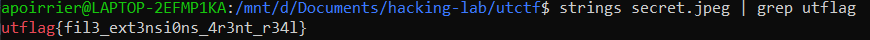

# [basics] Forensics
Forensics

## Description

> My friend said they hid a flag in this picture, but it's broken!

A broken jpeg image is attached.

## Solution

Just use ```strings``` on the image (it happens it is not at all an image but just a text file).


Flag: utflag{fil3_ext3nsi0ns_4r3nt_r34l}