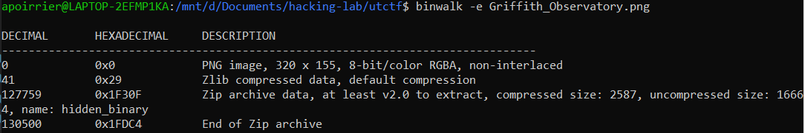
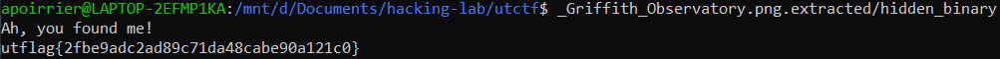

# Observe Closely
Forensics

## Description

> A simple image with a couple of twists...

Attached is a jpeg image.

## Solution

First I have used strings to find the flag. Sadly, no flag, but the string `hidden_binaryUT` caught my attention. Probably a binary is hidden in the image.

Indeed, by running `binwalk`, there is a binary in it:

Then we can run it to find the flag

Flag: `utflag{2fbe9adc2ad89c71da48cabe90a121c0}`