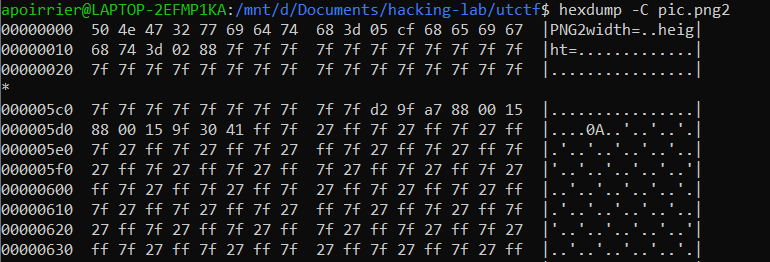

# .PNG2
Reverse engineering

## Description

> In an effort to get rid of all of  the bloat in the .png format, I'm proud to announce .PNG2! 
>
> The first  pixel is #7F7F7F, can you get the rest of the image? 

Attached is a .png2 file.

## Solution

Reading the hexdump of the file:



We can see that this is a raw image of `width = 0x5cf` and `height = 0x288`. Using `hexdump` to extract raw data, this Python script recovers the file as a png:

```python
from PIL import Image
import numpy as np

w, h = 0x5cf, 0x288
data = np.zeros((h, w, 3), dtype=np.uint8)
i, j, c = 0, 0, 0

def add_pixel(v):
    global i
    global j
    global c
    global data

    if j == h:
        return
    data[j][i][c] = int(v, 16)
    c += 1
    if c == 3:
        c = 0
        i += 1
        if i == w:
            i = 0
            j += 1

add_pixel('7f')
add_pixel('7f')
add_pixel('7f')
with open('pic_dump', "r") as f:
    for l in f:
        split = l[:len(l)-1].split(' ')
        for b in split:
            if len(b) == 4:
                add_pixel(b[2:])
                add_pixel(b[:2])

img = Image.fromarray(data, 'RGB')
img.save('pic.png')
```
This gives this image with the flag:


Flag: `utflag{j139adfo_93u12hfaj}`
